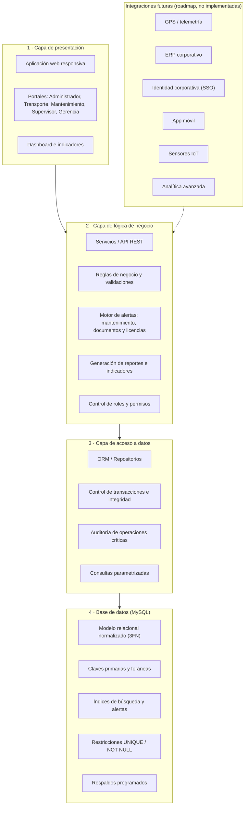
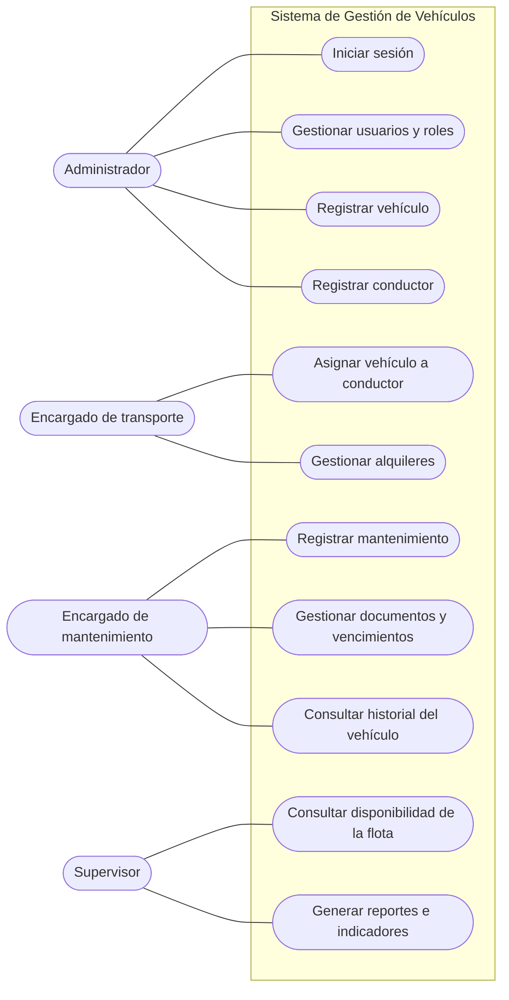
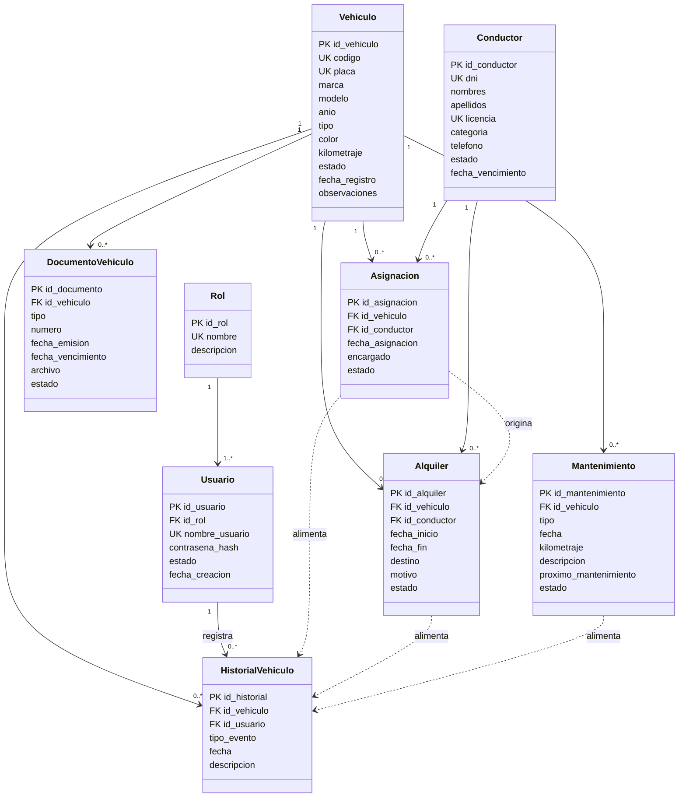
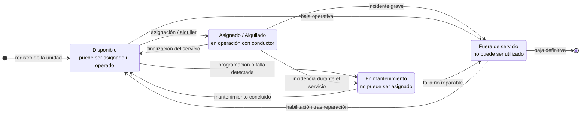

# Sistema de Gestión de Flota Vehicular para Empresa Minera

Trabajos de **Programación Orientada a Objetos (POO)** — IESTP "Paiján", La Libertad, Perú.
Docente: Ing. Carlos Abilio Angulo Zegarra · Semana 02 · SA2-POO-S2 · Indicador de logro C4.I1.

Este repositorio contiene el análisis y diseño orientado a objetos de un **sistema de gestión de flota vehicular para una empresa minera**: modelo de dominio, requerimientos, diagramas UML (casos de uso, clases, estados, secuencia), catálogo de clases, diseño de base de datos en MySQL y arquitectura en capas. **No contiene código de aplicación**: es un proyecto de análisis y diseño (documentación + diagramas + script SQL).

## ¿Qué problema resuelve?

La flota de una operación minera suele registrarse en hojas de cálculo y reportes manuales. El sistema propuesto centraliza vehículos, conductores, asignaciones, alquileres, mantenimientos, documentos, inspecciones, combustible, incidentes y un historial auditable, para responder: qué unidades están disponibles, cuáles requieren mantenimiento, qué documentos o licencias están por vencer y dónde se concentran el gasto y el riesgo.

## Estructura del repositorio

```text
.
├── README.md                     # Este archivo: visión general y arquitectura
├── docs/                         # Documentación en Markdown (versión legible en GitHub)
│   ├── 01-modelado-dominio-y-requerimientos.md   # Dominio, RF/RNF, casos de uso, BD lógica, arquitectura, dashboard
│   ├── 02-diagramas-uml.md                       # Casos de uso, modelo conceptual y modelo extendido
│   ├── 03-catalogo-de-clases.md                  # 25 clases en 7 módulos, atributos y responsabilidades
│   ├── 04-analisis-oo-y-base-de-datos.md         # Análisis OO, procesos, estados, secuencia, modelo lógico y SQL
│   ├── 05-informe-diagrama-de-clases.md          # Informe del diagrama de clases UML (19 clases)
│   └── img/                                      # Figuras de los documentos (PNG/JPG)
├── diagrams/                     # Diagramas en Mermaid (texto editable, se ven en GitHub)
│   ├── arquitectura-capas.mmd
│   ├── casos-de-uso.mmd
│   ├── clases-dominio.mmd        # 19 clases del dominio
│   ├── modelo-conceptual.mmd     # 9 clases del modelo conceptual
│   ├── modelo-extendido.mmd      # Modelo con GPS, costos, proveedores y reportes (roadmap)
│   ├── mapa-clases-modulos.mmd   # 25 clases agrupadas en 7 módulos
│   ├── jerarquia-usuarios.mmd
│   ├── estados-vehiculo.mmd
│   ├── flujo-operativo.mmd
│   ├── secuencia-conceptual.mmd
│   └── modelo-logico-bd.mmd      # Diagrama entidad-relación de la base de datos
├── database/
│   ├── schema.sql                # Script MySQL: base gestion_vehiculos, 9 tablas, claves e índices
│   └── queries.sql               # Consultas operativas recomendadas
└── originales/                   # Entregables originales (Word y PDF)
```

## Arquitectura del sistema

Arquitectura en capas: cada capa depende solo de la inmediata inferior; las integraciones futuras (GPS, ERP, SSO, app móvil, IoT, analítica) se acoplan a la capa de negocio sin cambiar el diseño actual.



## Módulos funcionales

| Módulo | Qué hace | Entidades principales |
| --- | --- | --- |
| Organización | Estructura Empresa → Unidad minera → Área | Empresa, UnidadMinera, Area |
| Flota | Registro y estado de los vehículos | TipoVehiculo, Vehiculo |
| Conductores | Personal habilitado y vigencia de licencia | Conductor |
| Operación | Asignación de vehículos y alquileres (condicional) | Asignacion, Alquiler |
| Mantenimiento | Preventivo y correctivo, con alertas | TipoMantenimiento, Mantenimiento |
| Documentación | Documentos vehiculares y vencimientos | TipoDocumento, DocumentoVehiculo |
| Inspecciones | Checklist de seguridad preoperacional | Inspeccion, DetalleInspeccion |
| Combustible | Consumo y costo | Combustible |
| Incidentes | Eventos de seguridad y su gravedad | Incidente |
| Historial y auditoría | Bitácora de solo inserción por vehículo | HistorialVehiculo |
| Seguridad y accesos | Usuarios, roles y permisos | Usuario, Rol |
| Reportes e indicadores | Dashboard gerencial | (consulta sobre todas las clases) |

## Actores y casos de uso

Cuatro perfiles acceden mediante autenticación; sus funciones dependen del rol asignado.



## Modelo conceptual de clases

El vehículo es la clase central: concentra asignaciones, alquileres, mantenimientos, documentos e historial. Las flechas punteadas "alimenta" indican que asignaciones, alquileres y mantenimientos generan automáticamente eventos en `HistorialVehiculo`.



## Ciclo de vida del vehículo

Una unidad en mantenimiento o fuera de servicio no puede asignarse ni alquilarse.



## Diagramas disponibles

| Diagrama | Archivo Mermaid | Documento donde se explica |
| --- | --- | --- |
| Arquitectura en capas | [`diagrams/arquitectura-capas.mmd`](diagrams/arquitectura-capas.mmd) | [01](docs/01-modelado-dominio-y-requerimientos.md) |
| Casos de uso | [`diagrams/casos-de-uso.mmd`](diagrams/casos-de-uso.mmd) | [02](docs/02-diagramas-uml.md) |
| Clases del dominio (19) | [`diagrams/clases-dominio.mmd`](diagrams/clases-dominio.mmd) | [01](docs/01-modelado-dominio-y-requerimientos.md), [05](docs/05-informe-diagrama-de-clases.md) |
| Modelo conceptual (9 clases) | [`diagrams/modelo-conceptual.mmd`](diagrams/modelo-conceptual.mmd) | [02](docs/02-diagramas-uml.md), [04](docs/04-analisis-oo-y-base-de-datos.md) |
| Modelo extendido | [`diagrams/modelo-extendido.mmd`](diagrams/modelo-extendido.mmd) | [02](docs/02-diagramas-uml.md) |
| Mapa de 25 clases por módulo | [`diagrams/mapa-clases-modulos.mmd`](diagrams/mapa-clases-modulos.mmd) | [03](docs/03-catalogo-de-clases.md) |
| Jerarquía de usuarios | [`diagrams/jerarquia-usuarios.mmd`](diagrams/jerarquia-usuarios.mmd) | [03](docs/03-catalogo-de-clases.md) |
| Estados del vehículo | [`diagrams/estados-vehiculo.mmd`](diagrams/estados-vehiculo.mmd) | [04](docs/04-analisis-oo-y-base-de-datos.md) |
| Flujo operativo del servicio | [`diagrams/flujo-operativo.mmd`](diagrams/flujo-operativo.mmd) | [04](docs/04-analisis-oo-y-base-de-datos.md) |
| Secuencia conceptual | [`diagrams/secuencia-conceptual.mmd`](diagrams/secuencia-conceptual.mmd) | [04](docs/04-analisis-oo-y-base-de-datos.md) |
| Modelo lógico de base de datos (ER) | [`diagrams/modelo-logico-bd.mmd`](diagrams/modelo-logico-bd.mmd) | [04](docs/04-analisis-oo-y-base-de-datos.md) |

## Base de datos

Modelo relacional normalizado (3FN) sobre MySQL. Tablas: `rol`, `usuario`, `vehiculo`, `conductor`, `asignacion`, `alquiler`, `mantenimiento`, `documento_vehiculo`, `historial_vehiculo`.

- Script de creación: [`database/schema.sql`](database/schema.sql)
- Consultas operativas: [`database/queries.sql`](database/queries.sql)
- La tabla `historial_vehiculo` es de solo inserción (append-only) para conservar la auditoría.

Para probarlo en MySQL:

```bash
mysql -u root -p < database/schema.sql
```

## Alcance

El alcance inicial se concentra en flota, personal, mantenimiento, documentación y combustible. Seguimiento GPS, costos operativos, proveedores y reportes avanzados figuran como capacidades previstas en el roadmap del modelo extendido, no como funcionalidad implementada.

## Nota sobre los datos de ejemplo

Las empresas, placas, talleres, nombres de personas y cifras que aparecen en los documentos son ejemplos didácticos construidos para el caso de estudio y no corresponden a organizaciones ni personas reales.
