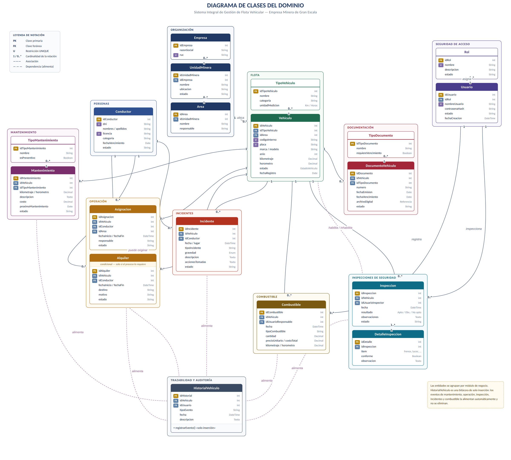
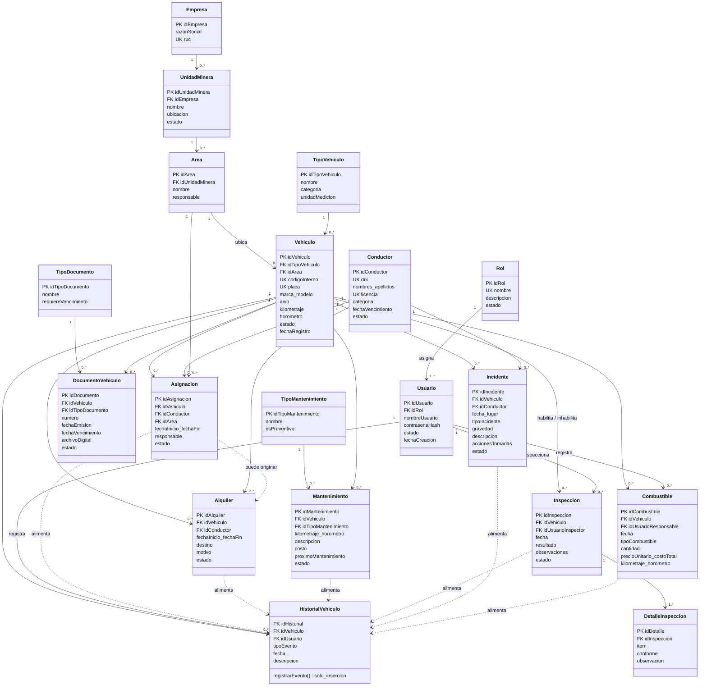
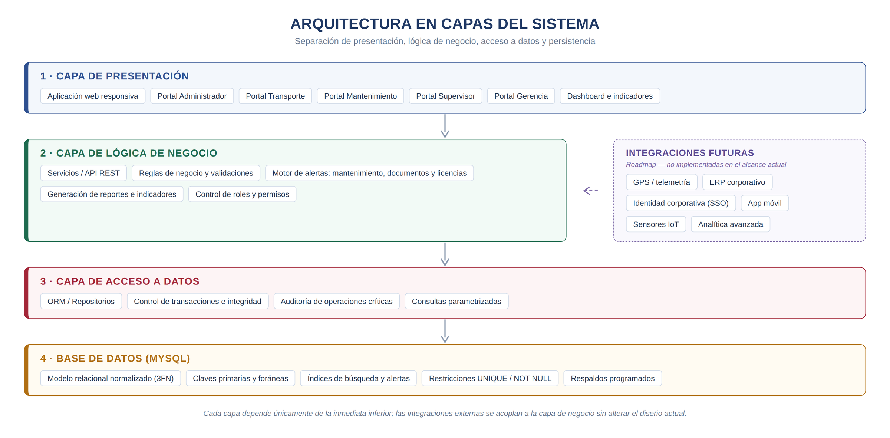
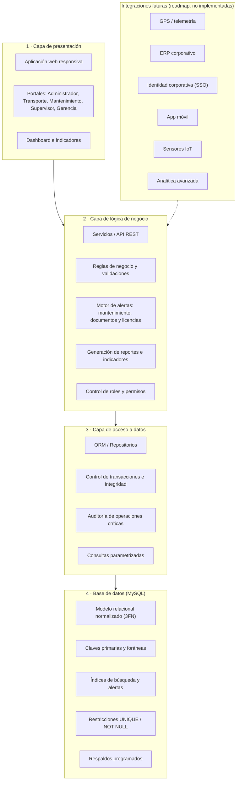
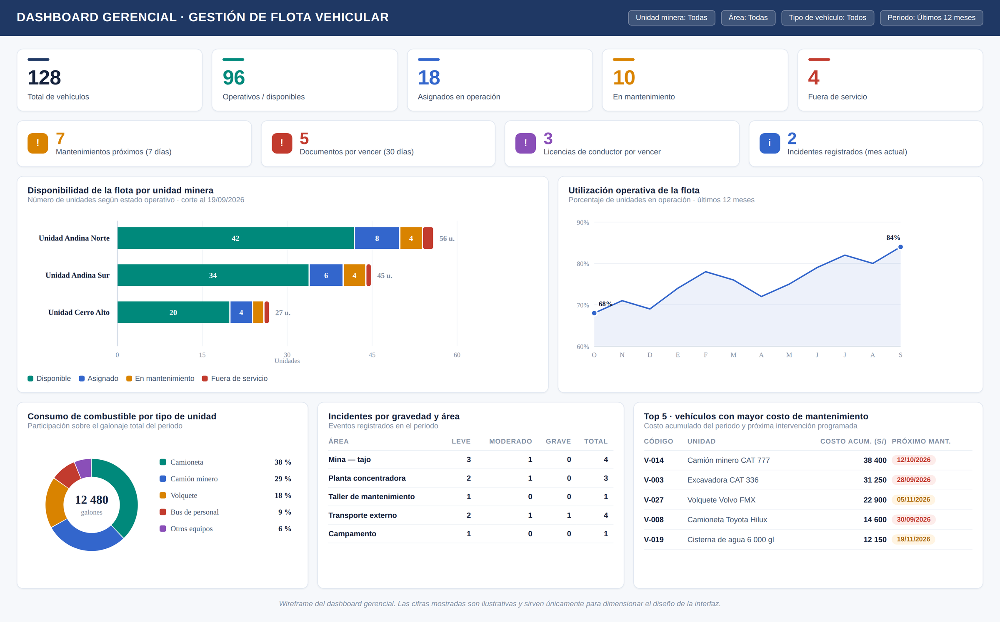

# Modelado del dominio y especificación de requerimientos

> Parte del proyecto [Sistema de Gestión de Flota Vehicular](../README.md) · Documento original en Word: [`01 - Modelado del dominio y especificacion de requerimientos.docx`](../originales/01%20-%20Modelado%20del%20dominio%20y%20especificacion%20de%20requerimientos.docx)

---

**GERENCIA REGIONAL DE EDUCACIÓN LA LIBERTAD**

INSTITUTO DE EDUCACIÓN SUPERIOR TECNOLÓGICO PÚBLICO

**“PAIJÁN”**

**PROPUESTA TÉCNICA — ANÁLISIS Y DISEÑO DE SISTEMAS**

**SISTEMA INTEGRAL DE GESTIÓN DE FLOTA VEHICULAR**

**PARA UNA EMPRESA MINERA DE GRAN ESCALA**

*Modelo de dominio, especificación de requerimientos, arquitectura y diseño de base de datos*

Documento elaborado desde la perspectiva de arquitectura de software, análisis de sistemas y consultoría de bases de datos relacionales para el sector minero.

| **Unidad didáctica** | Programación Orientada a Objetos (POO) |
| --- | --- |
| **Semana / Sesión** | Semana 02 · SA2-POO-S2 |
| **Indicador de logro** | C4.I1 |
| **Docente** | Ing. Carlos Abilio Angulo Zegarra |
| **Versión del documento** | Versión 2.1 — propuesta inicial sujeta a validación con los responsables del proceso |
| **Estado** | Para revisión funcional |

Paiján — La Libertad, Perú

**Septiembre de 2026**

## 1. Resumen ejecutivo

Este documento presenta el modelado del dominio y la especificación de requerimientos de un sistema integral de gestión de flota vehicular para una empresa minera de gran escala. Su propósito es servir como base formal, verificable y trazable para el diseño detallado y la posterior construcción del sistema.

### 1.1 ¿Qué problema resuelve?

La operación de una flota vehicular a escala minera —repartida entre distintas unidades mineras, áreas operativas y proveedores— tiende a generar información dispersa en hojas de cálculo, reportes manuales y registros físicos. Esto dificulta saber, en un momento dado, qué unidades están disponibles, cuáles requieren mantenimiento, qué documentos están por vencer o qué conductores tienen licencias vencidas. El sistema propuesto no asume la ausencia de sistemas previos: se plantea como una fuente centralizada de información que puede complementarse o integrarse posteriormente con otras plataformas corporativas ya existentes.

### 1.2 ¿Qué mejora?

- Visibilidad en tiempo real del estado y de la ubicación organizacional de cada unidad.

- Control y trazabilidad de asignaciones, uso operativo y mantenimiento.

- Gestión documental con alertas anticipadas de vencimiento.

- Cumplimiento de inspecciones de seguridad antes de la operación.

- Visibilidad del consumo de combustible y de los incidentes registrados.

### 1.3 ¿Qué información centraliza?

Vehículos, tipos de unidad, conductores, asignaciones (y alquileres si el proceso lo requiere), mantenimientos preventivos y correctivos, documentación vehicular, inspecciones de seguridad, consumo de combustible, incidentes, y el historial de auditoría de cada unidad — todo enmarcado en la estructura organizacional Empresa → Unidad Minera → Área.

### 1.4 ¿Qué decisiones facilita?

| **Pregunta de gestión** | **Información que entrega el sistema** |
| --- | --- |
| **¿Con qué flota cuento hoy?** | Vehículos disponibles en cada unidad minera y área, con su estado operativo actualizado. |
| **¿Qué debo intervenir primero?** | Unidades con mantenimiento próximo o vencido según fecha, kilometraje u horómetro. |
| **¿Estoy en regla?** | Documentos vehiculares y licencias de conductor próximos a vencer. |
| **¿Dónde se concentra el gasto?** | Vehículos con mayor consumo de combustible o mayor costo acumulado de mantenimiento. |
| **¿Dónde está el riesgo?** | Unidades y áreas que concentran la mayor cantidad y gravedad de incidentes. |
| **¿Está bien distribuida la flota?** | Nivel de utilización y disponibilidad por unidad minera y área. |

## 2. Introducción

### 2.1 Propósito del documento

Este documento presenta el modelado del dominio, la especificación de requerimientos, el modelo de base de datos, la arquitectura y el diseño de módulos del Sistema Integral de Gestión de Flota Vehicular, como propuesta inicial de análisis y diseño para una empresa minera de gran escala. Constituye la base formal para el diseño detallado, el levantamiento de procesos y la validación con los responsables funcionales antes de una implementación real.

### 2.2 Alcance

El sistema contempla, según lo que la organización defina en el alcance final, distintos tipos de unidades operativas: camionetas, camiones, buses, cisternas, vehículos de emergencia, vehículos de apoyo y otros equipos móviles — sin limitarse conceptualmente a un solo tipo. El sistema no asume procesos específicos no confirmados por la empresa; cualquier regla no validada se presenta explícitamente como propuesta inicial sujeta a validación.

> **Criterio de elaboración** Cuando un proceso no ha sido confirmado por la empresa, este documento lo presenta como propuesta y no como hecho. Los elementos condicionales —por ejemplo, el módulo de alquileres— se identifican como tales a lo largo del texto y del modelo.

### 2.3 Glosario

| **Término** | **Definición** |
| --- | --- |
| **RF / RNF** | Requerimiento Funcional / Requerimiento No Funcional. |
| **PK / FK** | Primary Key (clave primaria) / Foreign Key (clave foránea). |
| **3FN** | Tercera Forma Normal de un modelo relacional. |
| **HSE** | Salud, Seguridad y Medio Ambiente (Health, Safety & Environment). |
| **Horómetro** | Contador de horas de operación de un equipo, alternativo al kilometraje. |
| **Asignación** | Vínculo administrativo entre un vehículo y un conductor o área responsable. |
| **Alquiler** | Uso operativo puntual de un vehículo, distinto de la asignación administrativa; se incorpora solo si el negocio lo requiere. |
| **Append-only** | Tabla de solo inserción: los registros se agregan pero no se eliminan ni modifican, para preservar la auditoría. |

## 3. Contexto empresarial y objetivos

### 3.1 Contexto operativo

La empresa puede operar múltiples unidades mineras y áreas, con flota propia y personal con distintos niveles de autorización. La solución debe estar preparada para crecer en número de vehículos, usuarios, unidades mineras y volumen de registros históricos, sin rediseño estructural.

### 3.2 Objetivo general

> Diseñar un sistema que permita administrar, controlar y analizar la flota vehicular de una empresa minera, mejorando la disponibilidad de las unidades, la trazabilidad de sus operaciones, el control de mantenimiento, la gestión documental, la seguridad y la toma de decisiones.

### 3.3 Objetivos específicos

- Registrar y administrar vehículos, controlando su estado operativo.

- Registrar conductores y operadores autorizados, evitando duplicidad de DNI y licencia.

- Gestionar asignaciones de vehículos y, cuando corresponda, alquileres.

- Controlar mantenimientos preventivos y correctivos, con alertas anticipadas.

- Registrar kilometraje y/u horómetro según el tipo de unidad.

- Gestionar documentos vehiculares y sus vencimientos.

- Registrar inspecciones de seguridad mediante un checklist configurable.

- Controlar el consumo y el costo de combustible.

- Registrar incidentes y mantener su trazabilidad.

- Mantener una bitácora histórica auditable por unidad.

- Gestionar usuarios, roles y permisos de acceso.

- Generar reportes operativos, indicadores de gestión y un dashboard gerencial.

## 4. Modelado del dominio

Las entidades del dominio se identificaron a partir de una necesidad de negocio real y verificable; no se incorporaron entidades adicionales solo para ampliar el modelo. Cada clase responde a un módulo funcional concreto del sistema.

### 4.1 Entidades del dominio y justificación de negocio

| **Módulo** | **Entidades** | **Justificación de negocio** |
| --- | --- | --- |
| **Organización** | Empresa, UnidadMinera, Area | Permite consultar y filtrar la flota por unidad minera y área, reflejando la estructura real de una operación minera con múltiples frentes. |
| **Flota** | TipoVehiculo, Vehiculo | Evita texto libre para el tipo de unidad y habilita diferenciar el control por kilómetros u horómetro según corresponda. |
| **Personas** | Conductor | Controla al personal habilitado para operar, con vigencia de licencia verificable. |
| **Operación** | Asignacion, Alquiler (condicional) | Diferencia el vínculo administrativo vehículo–responsable (Asignación) del uso operativo puntual con destino y motivo (Alquiler); esta última solo si el proceso real de la empresa lo requiere. |
| **Mantenimiento** | TipoMantenimiento, Mantenimiento | Separa el catálogo de tipos (preventivo/correctivo) del registro de cada intervención, habilitando alertas por fecha, kilometraje u horómetro. |
| **Documentación** | TipoDocumento, DocumentoVehiculo | Controla documentos obligatorios (SOAT, revisión técnica, seguro, permisos) evitando texto libre y habilitando alertas de vencimiento. |
| **Inspecciones** | Inspeccion, DetalleInspeccion | Registra el checklist de seguridad preoperacional; el detalle permite un checklist configurable ítem por ítem. |
| **Combustible** | Combustible | Controla consumo, costo y kilometraje/horómetro al momento de abastecer, insumo para indicadores de eficiencia. |
| **Incidentes** | Incidente | Registra eventos de seguridad vial u operativa, su gravedad y las acciones tomadas. |
| **Trazabilidad** | HistorialVehiculo | Bitácora de auditoría: qué ocurrió, cuándo, con qué vehículo y qué usuario lo registró. |
| **Seguridad de acceso** | Usuario, Rol | Controla el acceso al sistema y limita las funciones disponibles según el perfil del usuario. |

### 4.2 Diagrama de clases del dominio

El diagrama agrupa las entidades por módulo de negocio y muestra atributos, claves (PK/FK), restricciones de unicidad y cardinalidades, como base directa para el modelo lógico de base de datos. Se presenta a página completa en la hoja siguiente.

*Figura 1. Diagrama de clases del dominio — Sistema Integral de Gestión de Flota Vehicular (empresa minera).*

Versión en Mermaid de la Figura 1 (texto editable)

### 4.3 Relaciones y cardinalidades principales

| **Relación** | **Cardinalidad** | **Regla de negocio asociada** |
| --- | --- | --- |
| **Empresa — UnidadMinera — Area** | 1 : 0..* 1 : 0..* | Estructura jerárquica organizacional; toda unidad minera pertenece a una empresa y toda área a una unidad minera. |
| **Area — Vehiculo** | 1 : 0..* | Cada vehículo está ubicado organizacionalmente en un área, lo que permite filtrar la flota por unidad minera y área. |
| **TipoVehiculo — Vehiculo** | 1 : 0..* | El tipo determina si el control se realiza por kilometraje, horómetro u otro indicador. |
| **Vehiculo — Asignacion / Alquiler** | 1 : 0..* | Un vehículo acumula múltiples asignaciones y alquileres a lo largo del tiempo; ambos procesos se diferencian conceptualmente. |
| **Conductor — Asignacion / Alquiler / Incidente** | 1 : 0..* | Un conductor puede tener múltiples asignaciones, alquileres e incidentes asociados. |
| **Vehiculo — Mantenimiento — TipoMantenimiento** | 1 : 0..* 1 : 0..* | Cada mantenimiento pertenece a un vehículo y a un tipo (preventivo o correctivo) del catálogo. |
| **Vehiculo — DocumentoVehiculo — TipoDocumento** | 1 : 0..* 1 : 0..* | Cada documento pertenece a un vehículo y a un tipo de documento controlado por catálogo. |
| **Vehiculo — Inspeccion — DetalleInspeccion** | 1 : 0..* 1 : 1..* | Cada inspección puede inhabilitar al vehículo para operar según su resultado; el detalle registra cada ítem del checklist. |
| **Vehiculo — Combustible** | 1 : 0..* | Cada abastecimiento registra kilometraje u horómetro al momento de cargar combustible. |
| **Rol — Usuario** | 1 : 1..* | Todo usuario requiere un rol que determina las funciones disponibles. |
| **Eventos operativos → HistorialVehiculo** | Dependencia | Los eventos relevantes del vehículo (mantenimiento, alquiler, asignación, inspección, incidente y combustible) se reflejan automáticamente en su bitácora histórica. |

### 4.4 Reglas de negocio del dominio

| **N.º** | **Regla de negocio** | **Se garantiza mediante** |
| --- | --- | --- |
| **RN-01** | La placa de un vehículo no puede repetirse. | UNIQUE(placa) |
| **RN-02** | El código interno de un vehículo no puede repetirse. | UNIQUE(codigoInterno) |
| **RN-03** | El DNI de un conductor no puede repetirse. | UNIQUE(dni) |
| **RN-04** | Una licencia no puede pertenecer a dos conductores distintos. | UNIQUE(licencia) |
| **RN-05** | Un vehículo no puede tener dos operaciones incompatibles activas de forma simultánea (por ejemplo, dos asignaciones vigentes). | Validación en la capa de negocio |
| **RN-06** | Un vehículo en estado “En mantenimiento” no puede ser asignado para operación. | Validación de estado |
| **RN-07** | Un vehículo en estado “Fuera de servicio” no puede ser utilizado. | Validación de estado |
| **RN-08** | Todo registro de mantenimiento debe incluir como mínimo vehículo, tipo, fecha y estado. | NOT NULL + validación |
| **RN-09** | Los documentos con vencimiento deben conservar su fecha para habilitar alertas. | NOT NULL condicional |
| **RN-10** | Las operaciones críticas (cambios de estado, mantenimientos, incidentes) deben quedar auditadas en el historial. | Inserción en HistorialVehiculo |
| **RN-11** | Los registros históricos no deben eliminarse mediante operaciones ordinarias. | Tabla append-only |
| **RN-12** | Las funciones disponibles para un usuario dependen exclusivamente de su rol asignado. | Control de acceso por rol |
| **RN-13** | El resultado de una inspección puede habilitar o inhabilitar a un vehículo para operar. | Validación de negocio |

## 5. Especificación de requerimientos

### 5.1 Requerimientos funcionales

| **ID** | **Descripción** | **Prioridad** |
| --- | --- | --- |
| **RF-01** | Registrar, modificar, consultar y buscar vehículos. | Alta |
| **RF-02** | Registrar y gestionar conductores y operadores. | Alta |
| **RF-03** | Gestionar asignaciones y, cuando corresponda, alquileres. | Alta |
| **RF-04** | Controlar el estado y la disponibilidad de cada vehículo. | Alta |
| **RF-05** | Registrar y controlar mantenimientos preventivos y correctivos. | Alta |
| **RF-06** | Gestionar la documentación vehicular y sus vencimientos. | Media |
| **RF-07** | Registrar inspecciones de seguridad mediante checklist. | Media |
| **RF-08** | Registrar el consumo y el costo de combustible. | Media |
| **RF-09** | Registrar incidentes relacionados con vehículos. | Media |
| **RF-10** | Mantener el historial y la trazabilidad de cada unidad. | Alta |
| **RF-11** | Gestionar usuarios, roles y permisos. | Alta |
| **RF-12** | Generar reportes operativos y gerenciales. | Media |
| **RF-13** | Generar alertas de mantenimiento, documentación y licencias. | Alta |
| **RF-14** | Generar indicadores de gestión de flota (dashboard). | Media |

### 5.2 Requerimientos no funcionales

#### 5.2.1 Seguridad

| **ID** | **Descripción** |
| --- | --- |
| **RNF-01** | Autenticación de usuario y autorización basada en el rol asignado. |
| **RNF-02** | Contraseñas almacenadas mediante un algoritmo de hash seguro, nunca en texto plano. |
| **RNF-03** | Auditoría de operaciones críticas (cambios de estado, mantenimientos, incidentes) con usuario y fecha. |

#### 5.2.2 Integridad

| **ID** | **Descripción** |
| --- | --- |
| **RNF-04** | Uso de claves primarias, claves foráneas y restricciones UNIQUE y NOT NULL cuando corresponda. |
| **RNF-05** | Integridad referencial completa entre tablas relacionadas y validaciones de negocio en la capa de aplicación. |

#### 5.2.3 Rendimiento y disponibilidad

| **ID** | **Descripción** |
| --- | --- |
| **RNF-06** | Las consultas frecuentes (disponibilidad, búsqueda de vehículos) deben estar optimizadas mediante índices apropiados. |
| **RNF-07** | El sistema debe contar con mecanismos de respaldo y recuperación ante fallos. |

#### 5.2.4 Usabilidad y escalabilidad

| **ID** | **Descripción** |
| --- | --- |
| **RNF-08** | Cada perfil de usuario debe poder completar sus operaciones frecuentes sin pasos innecesarios. |
| **RNF-09** | La arquitectura y la base de datos deben soportar el crecimiento en número de vehículos, usuarios, unidades mineras y registros históricos, sin rediseño estructural. |

### 5.3 Casos de uso principales

| **ID** | **Actor** | **Caso de uso** | **Precondición** |
| --- | --- | --- | --- |
| **CU-01** | Encargado de transporte | Registrar asignación de vehículo | El vehículo está en estado Disponible. |
| **CU-02** | Encargado de transporte | Registrar alquiler de vehículo | Existe el proceso de alquiler y el vehículo está disponible. |
| **CU-03** | Encargado de mantenimiento | Registrar mantenimiento preventivo o correctivo | El vehículo existe en el sistema. |
| **CU-04** | Encargado de mantenimiento | Gestionar documentación vehicular | El tipo de documento está definido en el catálogo. |
| **CU-05** | Supervisor / Inspector | Registrar inspección de seguridad | El vehículo va a iniciar operación. |
| **CU-06** | Encargado de transporte | Registrar consumo de combustible | El vehículo está operativo. |
| **CU-07** | Cualquier usuario autorizado | Registrar incidente | Ocurrió un evento relacionado con una unidad. |
| **CU-08** | Administrador | Gestionar usuarios y roles | El usuario que ejecuta la acción tiene rol Administrador. |
| **CU-09** | Gerencia / Supervisor | Consultar dashboard e indicadores | El usuario tiene permisos de consulta. |
| **CU-10** | Administrador | Consultar historial y auditoría de un vehículo | El vehículo existe en el sistema. |

### 5.4 Matriz de trazabilidad

Cada requerimiento queda vinculado a su o sus entidades de origen y al caso de uso que lo verifica, habilitando pruebas de aceptación posteriores.

| **RF** | **Entidad(es) / Tabla(s)** | **Caso de uso** | **Criterio de verificación** |
| --- | --- | --- | --- |
| **RF-01** | Vehiculo, TipoVehiculo, Area | — | No se permiten placas ni códigos internos duplicados. |
| **RF-02** | Conductor | — | No se permiten DNI ni licencias duplicadas. |
| **RF-03** | Asignacion, Alquiler | CU-01, CU-02 | No se asigna ni alquila un vehículo que no esté Disponible. |
| **RF-04** | Vehiculo | CU-01, CU-03 | El estado del vehículo refleja la última operación registrada. |
| **RF-05** | Mantenimiento, TipoMantenimiento | CU-03 | Todo mantenimiento genera alerta de próximo mantenimiento cuando aplica. |
| **RF-06** | DocumentoVehiculo, TipoDocumento | CU-04 | El sistema lista los documentos dentro del rango de alerta de vencimiento. |
| **RF-07** | Inspeccion, DetalleInspeccion | CU-05 | Un resultado “No apto” impide la operación del vehículo. |
| **RF-08** | Combustible | CU-06 | Todo registro asocia cantidad, costo y kilometraje u horómetro. |
| **RF-09** | Incidente | CU-07 | Todo incidente queda asociado a vehículo, conductor y gravedad. |
| **RF-10** | HistorialVehiculo | CU-10 | Todo evento crítico genera un registro histórico no eliminable. |
| **RF-11** | Usuario, Rol | CU-08 | Un usuario solo accede a las funciones habilitadas por su rol. |
| **RF-12, RF-14** | Todas (consulta) | CU-09 | Los reportes e indicadores reflejan datos consistentes con las tablas fuente. |
| **RF-13** | Mantenimiento, DocumentoVehiculo, Conductor | — | Las alertas se generan antes de la fecha de vencimiento configurada. |

## 6. Modelo lógico de base de datos

Se propone un modelo relacional normalizado (hasta 3FN cuando corresponda) sobre MySQL, evitando texto libre en campos que representan catálogos (tipo de vehículo, tipo de mantenimiento, tipo de documento) y evitando duplicidad de información entre tablas.

### 6.1 Diccionario de datos resumido

| **Tabla** | **Clave primaria (PK)** | **Claves foráneas (FK)** | **Restricciones relevantes** |
| --- | --- | --- | --- |
| **empresa** | idEmpresa | — | ruc UNIQUE |
| **unidad_minera** | idUnidadMinera | idEmpresa → empresa | nombre NOT NULL |
| **area** | idArea | idUnidadMinera → unidad_minera | nombre NOT NULL |
| **tipo_vehiculo** | idTipoVehiculo | — | nombre UNIQUE |
| **vehiculo** | idVehiculo | idTipoVehiculo, idArea | placa UNIQUE, codigoInterno UNIQUE |
| **conductor** | idConductor | — | dni UNIQUE, licencia UNIQUE |
| **asignacion** | idAsignacion | idVehiculo, idConductor, idArea | fechaInicio NOT NULL |
| **alquiler** | idAlquiler | idVehiculo, idConductor | Solo si el proceso lo requiere |
| **tipo_mantenimiento** | idTipoMantenimiento | — | nombre UNIQUE |
| **mantenimiento** | idMantenimiento | idVehiculo, idTipoMantenimiento | fecha, estado NOT NULL |
| **tipo_documento** | idTipoDocumento | — | nombre UNIQUE |
| **documento_vehiculo** | idDocumento | idVehiculo, idTipoDocumento | fechaVencimiento condicional |
| **inspeccion** | idInspeccion | idVehiculo, idUsuarioInspector | resultado NOT NULL |
| **detalle_inspeccion** | idDetalle | idInspeccion | item, conforme NOT NULL |
| **combustible** | idCombustible | idVehiculo, idUsuarioResponsable | cantidad, costoTotal NOT NULL |
| **incidente** | idIncidente | idVehiculo, idConductor | gravedad NOT NULL |
| **historial_vehiculo** | idHistorial | idVehiculo, idUsuario | Solo INSERT (append-only) |
| **rol** | idRol | — | nombre UNIQUE |
| **usuario** | idUsuario | idRol | nombreUsuario UNIQUE, contrasenaHash NOT NULL |

### 6.2 Estrategia de integridad y rendimiento

- Índices sobre placa, codigoInterno, dni y licencia para búsquedas frecuentes y control de unicidad.

- Índices sobre fechas de vencimiento (documentos, licencias) y próximos mantenimientos, para soportar el motor de alertas.

- Claves foráneas con integridad referencial en todas las relaciones descritas en la sección 4.3.

- La tabla historial_vehiculo se diseña como tabla de solo inserción (append-only) para preservar la auditoría.

- Particionamiento o archivado histórico recomendado a mediano plazo para tablas de alto volumen (combustible, historial_vehiculo) conforme crezca la flota.

## 7. Arquitectura del sistema

Se propone una arquitectura en capas que separa presentación, lógica de negocio, acceso a datos y base de datos, dejando prevista la incorporación de integraciones futuras sin romper el diseño actual.

*Figura 2. Arquitectura en capas propuesta para el sistema.*

Versión en Mermaid de la Figura 2 (texto editable)

### 7.1 Módulos del sistema

| **Módulo** | **Funciones principales** |
| --- | --- |
| **Gestión de flota** | Registro y consulta de vehículos, tipos de vehículo, estados y ubicación organizacional. |
| **Gestión de conductores** | Registro de conductores, control de licencias y de su vigencia. |
| **Operación (asignación / alquiler)** | Vinculación de vehículos con conductores y áreas, y registro del uso operativo. |
| **Mantenimiento** | Programación y registro de mantenimientos preventivos y correctivos, con alertas. |
| **Documentación** | Gestión de documentos vehiculares y de sus vencimientos. |
| **Inspecciones** | Checklist de seguridad preoperacional y habilitación de unidades. |
| **Combustible** | Registro y análisis del consumo y del costo de combustible. |
| **Incidentes** | Registro y seguimiento de eventos de seguridad. |
| **Historial y auditoría** | Bitácora consolidada de eventos por vehículo. |
| **Seguridad y accesos** | Gestión de usuarios, roles y permisos. |
| **Reportes e indicadores** | Dashboard gerencial y reportes operativos. |

## 8. Dashboard empresarial e indicadores

El dashboard está orientado a la toma de decisiones, no solo a mostrar cifras: cada indicador permite identificar un problema operativo concreto y accionar sobre él. El wireframe de la página siguiente ilustra la disposición propuesta de la pantalla gerencial.

*Figura 3. Wireframe del dashboard gerencial de flota vehicular. Las cifras son ilustrativas y sirven para dimensionar el diseño de la interfaz.*

### 8.1 Indicadores incluidos

| **Indicador** | **Qué decisión apoya** |
| --- | --- |
| **Total de vehículos / operativos / asignados / en mantenimiento / fuera de servicio** | Disponibilidad real de la flota en un momento dado. |
| **Mantenimientos próximos y vencidos** | Priorización de intervenciones y prevención de fallas. |
| **Documentos y licencias próximos a vencer** | Cumplimiento normativo y prevención de sanciones. |
| **Incidentes por gravedad y área** | Identificación de zonas o unidades con mayor riesgo. |
| **Consumo y costo de combustible por vehículo o tipo** | Detección de consumos anómalos y control del costo operativo. |
| **Disponibilidad y utilización de la flota por unidad minera** | Balance de la carga operativa entre unidades y áreas. |
| **Top de vehículos con mayor costo de mantenimiento** | Evaluación de renovación o reasignación de unidades. |

## 9. Reportes

| **Reporte** | **Contenido** |
| --- | --- |
| **Reporte de flota** | Estado, tipo, área y unidad minera de cada vehículo. |
| **Reporte de mantenimiento** | Vehículos, tipo de mantenimiento, costos, fechas y próximos mantenimientos. |
| **Reporte de combustible** | Consumo, costos, periodos y vehículos con mayor gasto. |
| **Reporte documental** | Documentos vigentes, próximos a vencer y vencidos. |
| **Reporte de incidentes** | Cantidad, tipo, gravedad y vehículos o conductores involucrados. |

## 10. Seguridad y control de acceso

### 10.1 Roles iniciales propuestos

| **Rol** | **Funciones habilitadas** |
| --- | --- |
| **Administrador** | Usuarios, roles, configuración e información maestra del sistema. |
| **Encargado de transporte** | Asignaciones, alquileres, disponibilidad y uso de vehículos. |
| **Encargado de mantenimiento** | Mantenimiento, documentación vehicular y su programación. |
| **Supervisor** | Consultas, reportes e indicadores operativos. |
| **Gerencia** | Indicadores, reportes e información consolidada de gestión. |

El modelo de roles es extensible: nuevos roles y permisos podrán incorporarse posteriormente sin alterar la estructura de Usuario y Rol.

## 11. Escalabilidad y roadmap de futuras funcionalidades

### 11.1 Escalabilidad

La arquitectura en capas y el modelo relacional normalizado permiten incrementar el número de vehículos, usuarios, unidades mineras y registros históricos sin rediseño estructural, apoyándose en índices, en el particionamiento futuro de tablas de alto volumen y en la separación clara de responsabilidades entre capas.

### 11.2 Roadmap de integraciones futuras

> **Alcance** Las siguientes funcionalidades se presentan como posibles fases futuras y no como funcionalidades ya implementadas en el alcance actual.

- GPS y telemetría vehicular.

- Geolocalización y alertas automáticas en tiempo real.

- Aplicación móvil para conductores y supervisores de campo.

- Lectura de códigos QR para inspecciones y control de combustible.

- Integración con sensores IoT de los propios vehículos y equipos.

- Integración con sistemas ERP corporativos.

- Integración con sistemas de identidad corporativa (SSO).

- Analítica avanzada y mantenimiento predictivo.

## 12. Criterio profesional y siguientes pasos

Este documento no asume procesos específicos no confirmados por la empresa minera: cuando un proceso no ha sido validado, se presenta como propuesta inicial sujeta a validación con los responsables del área correspondiente (Transporte, Mantenimiento, Seguridad/HSE y Finanzas).

Antes de una implementación real se recomienda:

- Realizar entrevistas y el levantamiento de procesos con cada área.

- Validar las reglas de negocio descritas en la sección 4.4.

- Revisar los sistemas existentes susceptibles de integración.

- Definir el alcance final respecto a alquileres, tipos de unidad y checklist de inspección.

## 13. Conclusiones

El modelo propuesto cubre de forma disciplinada —sin complejidad artificial— el ciclo completo de gestión de una flota minera: organización, flota, personas, operación, mantenimiento, documentación, inspecciones, combustible, incidentes, trazabilidad y seguridad de acceso.

La especificación de requerimientos, la matriz de trazabilidad y el diccionario de datos quedan alineados entre sí, constituyendo una base profesional para avanzar hacia el diseño físico definitivo de la base de datos y la construcción del sistema.

> **Nota final** Las cifras que aparecen en el wireframe del dashboard (Figura 3) son ilustrativas y no corresponden a datos reales de ninguna empresa: su única finalidad es dimensionar el diseño de la interfaz.
