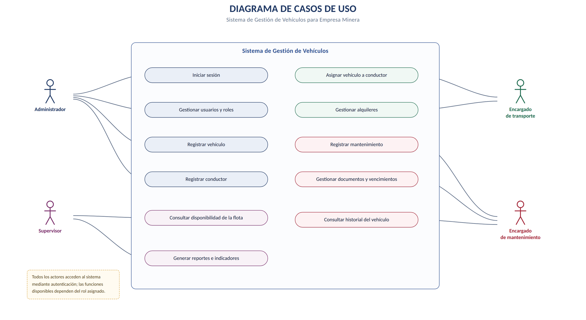
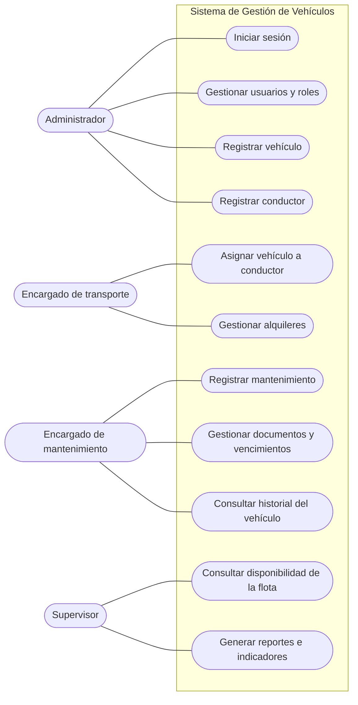
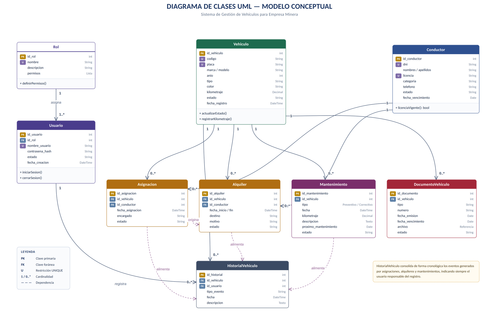
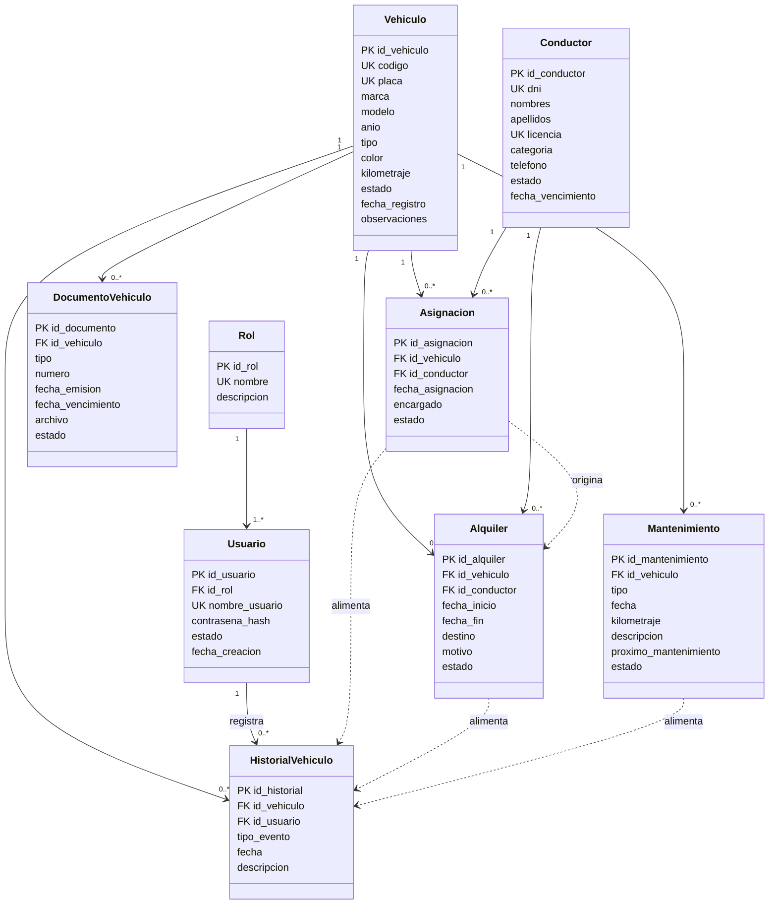
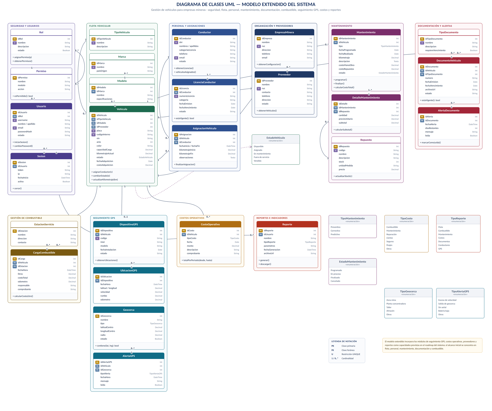
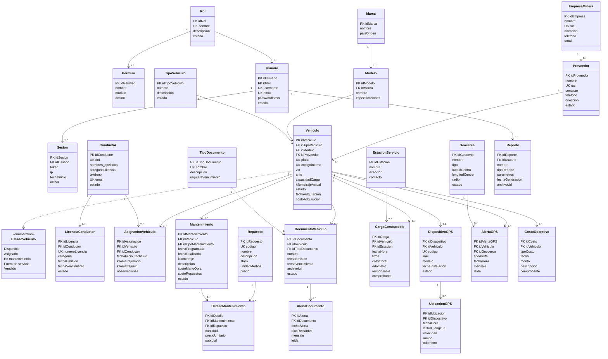

# Diagramas UML del sistema de gestión de vehículos

> Parte del proyecto [Sistema de Gestión de Flota Vehicular](../README.md) · Documento original en Word: [`02 - Diagramas UML del sistema de gestion de vehiculos.docx`](../originales/02%20-%20Diagramas%20UML%20del%20sistema%20de%20gestion%20de%20vehiculos.docx)

---

**GERENCIA REGIONAL DE EDUCACIÓN LA LIBERTAD**

INSTITUTO DE EDUCACIÓN SUPERIOR TECNOLÓGICO PÚBLICO

**“PAIJÁN”**

**ANEXO DE MODELADO VISUAL**

**DIAGRAMAS UML DEL SISTEMA DE GESTIÓN DE VEHÍCULOS**

**PARA EMPRESA MINERA**

*Casos de uso, modelo conceptual de clases y modelo extendido del dominio*

Los diagramas de este anexo se construyeron a partir de las entidades, actores, procesos y requerimientos descritos en el caso de estudio.

| **Unidad didáctica** | Programación Orientada a Objetos (POO) |
| --- | --- |
| **Semana / Sesión** | Semana 02 · SA2-POO-S2 |
| **Indicador de logro** | C4.I1 |
| **Docente** | Ing. Carlos Abilio Angulo Zegarra |
| **Notación** | UML 2.x — diagramas de casos de uso y de clases |
| **Contenido** | 3 diagramas a página completa con su guía de lectura |

Paiján — La Libertad, Perú

**Septiembre de 2026**

## 1. Propósito del anexo

Este anexo reúne los diagramas UML que representan visualmente el Sistema de Gestión de Vehículos para una empresa minera. Cada diagrama se presenta a página completa y va acompañado de una guía de lectura que identifica sus elementos, la notación empleada y la información que aporta al análisis.

Los diagramas no sustituyen a la especificación escrita: la complementan. El diagrama de casos de uso delimita qué hace el sistema y para quién; el modelo conceptual de clases define qué información gestiona; y el modelo extendido muestra hasta dónde puede crecer el sistema sin alterar su estructura.

### 1.1 Convenciones de notación

| **Elemento** | **Representación** | **Significado** |
| --- | --- | --- |
| **Actor** | Figura humana fuera del marco del sistema | Rol externo que interactúa con el sistema (no es una persona concreta, sino un perfil). |
| **Caso de uso** | Óvalo dentro del marco del sistema | Función completa que el sistema ofrece a un actor y que produce un resultado observable. |
| **Clase** | Rectángulo con nombre, atributos y operaciones | Entidad del dominio con datos y responsabilidades propias. |
| **PK / FK / U** | Etiqueta junto al atributo | Clave primaria, clave foránea y restricción de unicidad. |
| **Asociación** | Línea continua con cardinalidad | Relación estructural entre dos clases (1, 0..*, 1..*). |
| **Dependencia** | Línea discontinua con punta de flecha | Una clase usa o alimenta a otra sin contenerla. |
| **Generalización** | Línea con punta triangular hueca | Herencia: la clase hija especializa a la clase padre. |
| **«enumeración»** | Rectángulo con lista de valores | Conjunto cerrado de valores admitidos por un atributo. |
| **Módulo** | Marco de color que agrupa clases | Agrupación funcional; no es un elemento formal de UML, se usa como ayuda de lectura. |

> **Cómo leer los diagramas** Los tres diagramas describen el mismo sistema con distinto nivel de detalle. Se recomienda leerlos en el orden en que aparecen: primero el alcance funcional (casos de uso), después la estructura mínima de información (modelo conceptual) y por último la estructura ampliada (modelo extendido).

## 2. Diagrama de casos de uso

El diagrama de casos de uso delimita el alcance funcional del sistema: qué puede hacer cada perfil de usuario. Los actores se ubican fuera del marco del sistema y las funciones dentro de él. El color de cada caso de uso indica el actor responsable principal.

### 2.1 Actores del sistema

| **Actor** | **Participación en el sistema** | **Casos de uso principales** |
| --- | --- | --- |
| **Administrador** | Gestiona la información maestra y los accesos. | Iniciar sesión · Gestionar usuarios y roles · Registrar vehículo · Registrar conductor. |
| **Encargado de transporte** | Controla las operaciones de la flota. | Asignar vehículo a conductor · Gestionar alquileres. |
| **Encargado de mantenimiento** | Controla las intervenciones técnicas y los documentos. | Registrar mantenimiento · Gestionar documentos y vencimientos · Consultar historial del vehículo. |
| **Supervisor** | Consulta y supervisa la información de gestión. | Consultar disponibilidad de la flota · Generar reportes e indicadores. |

Todos los actores acceden al sistema mediante autenticación; las funciones disponibles para cada uno dependen exclusivamente del rol asignado.

*Figura 1. Diagrama de casos de uso del Sistema de Gestión de Vehículos para empresa minera.*

Versión en Mermaid de la Figura 1 (texto editable)

## 3. Diagrama de clases — modelo conceptual

El modelo conceptual representa el conjunto mínimo de clases necesario para cubrir el caso de estudio: flota, personal, operación, mantenimiento, documentación, trazabilidad y seguridad de acceso. Cada clase muestra sus atributos con la indicación de clave primaria, clave foránea y restricciones de unicidad, de modo que el diagrama sirve directamente como base del modelo de base de datos.

### 3.1 Clases del modelo conceptual

| **Clase** | **Responsabilidad principal** | **Se relaciona con** |
| --- | --- | --- |
| **Vehiculo** | Concentra la información de cada unidad y su estado operativo. | Asignacion, Alquiler, Mantenimiento, DocumentoVehiculo, HistorialVehiculo |
| **Conductor** | Registra al personal habilitado y controla la vigencia de su licencia. | Asignacion, Alquiler |
| **Asignacion** | Vincula un vehículo disponible con un conductor y un responsable. | Vehiculo, Conductor; origina Alquiler |
| **Alquiler** | Registra el uso operativo por periodo, con destino y motivo. | Vehiculo, Conductor, HistorialVehiculo |
| **Mantenimiento** | Registra intervenciones preventivas y correctivas y programa la siguiente. | Vehiculo, HistorialVehiculo |
| **DocumentoVehiculo** | Almacena documentos de la unidad y controla sus vencimientos. | Vehiculo |
| **HistorialVehiculo** | Consolida cronológicamente los eventos de cada unidad. | Vehiculo, Usuario |
| **Usuario** | Controla el acceso al sistema y registra al responsable de cada operación. | Rol, HistorialVehiculo |
| **Rol** | Define las funciones y los accesos permitidos. | Usuario |

> **Detalle de lectura** Las líneas discontinuas etiquetadas como “alimenta” indican dependencias: los registros de asignación, alquiler y mantenimiento generan automáticamente entradas en HistorialVehiculo, que se comporta como una bitácora de solo inserción.

*Figura 2. Diagrama de clases UML — modelo conceptual del Sistema de Gestión de Vehículos.*

Versión en Mermaid de la Figura 2 (texto editable)

## 4. Diagrama de clases — modelo extendido

El modelo extendido muestra hasta dónde puede crecer el sistema conservando la misma estructura de base. Añade los módulos de proveedores, seguimiento GPS, costos operativos y reportes, y desagrega catálogos que en el modelo conceptual estaban simplificados (marca, modelo, repuestos, tipos de documento).

> **Alcance** Los módulos de seguimiento GPS, costos operativos, proveedores y reportes se presentan como capacidades previstas en el roadmap del sistema. El alcance inicial de implementación se concentra en flota, personal, mantenimiento, documentación y combustible.

### 4.1 Módulos del modelo extendido

| **Módulo** | **Clases que lo componen** | **Aporte al sistema** |
| --- | --- | --- |
| **Seguridad y usuarios** | Rol, Permiso, Usuario, Sesion | Control granular de accesos por módulo y acción, con trazabilidad de sesiones. |
| **Flota vehicular** | TipoVehiculo, Marca, Modelo, Vehiculo | Catálogos normalizados que evitan texto libre y habilitan búsquedas por categoría. |
| **Personal y asignaciones** | Conductor, LicenciaConductor, AsignacionVehiculo | Separa al conductor de sus licencias, permitiendo varias categorías y su control de vigencia. |
| **Organización y proveedores** | EmpresaMinera, Proveedor | Vincula cada unidad con su proveedor y centraliza la configuración de la empresa. |
| **Mantenimiento** | Mantenimiento, DetalleMantenimiento, Repuesto | Desglosa el costo de cada intervención entre mano de obra y repuestos consumidos. |
| **Documentación y alertas** | TipoDocumento, DocumentoVehiculo, AlertaDocumento | Convierte los vencimientos en alertas gestionables con estado de lectura. |
| **Gestión de combustible** | EstacionServicio, CargaCombustible | Registra cada abastecimiento con odómetro y comprobante para calcular el rendimiento. |
| **Seguimiento GPS** | DispositivoGPS, UbicacionGPS, Geocerca, AlertaGPS | Habilita el monitoreo de posición y las alertas por geocerca o exceso de velocidad. |
| **Costos operativos** | CostoOperativo | Consolida el costo total de propiedad por unidad y por periodo. |
| **Reportes e indicadores** | Reporte | Registra los reportes generados, sus parámetros y el usuario que los solicitó. |

*Figura 3. Diagrama de clases UML — modelo extendido del sistema, con los módulos previstos en el roadmap.*

Versión en Mermaid de la Figura 3 (texto editable)

## 5. Correspondencia entre los tres diagramas

Los tres diagramas describen el mismo sistema desde perspectivas distintas. La siguiente tabla muestra cómo se corresponden sus elementos, de modo que el lector pueda recorrerlos de forma coherente.

| **Aspecto** | **Casos de uso (Fig. 1)** | **Modelo conceptual (Fig. 2)** | **Modelo extendido (Fig. 3)** |
| --- | --- | --- | --- |
| **Acceso al sistema** | Iniciar sesión · Gestionar usuarios y roles | Usuario, Rol | Usuario, Rol, Permiso, Sesion |
| **Alta de la flota** | Registrar vehículo | Vehiculo | Vehiculo, TipoVehiculo, Marca, Modelo, Proveedor |
| **Personal habilitado** | Registrar conductor | Conductor | Conductor, LicenciaConductor |
| **Operación diaria** | Asignar vehículo · Gestionar alquileres | Asignacion, Alquiler | AsignacionVehiculo |
| **Mantenimiento** | Registrar mantenimiento | Mantenimiento | Mantenimiento, DetalleMantenimiento, Repuesto |
| **Documentación** | Gestionar documentos y vencimientos | DocumentoVehiculo | TipoDocumento, DocumentoVehiculo, AlertaDocumento |
| **Trazabilidad** | Consultar historial del vehículo | HistorialVehiculo | HistorialVehiculo (+ UbicacionGPS) |
| **Gestión y análisis** | Consultar disponibilidad · Generar reportes | Consulta sobre todas las clases | Reporte, CostoOperativo |

## 6. Criterios de calidad del modelado

- Cada clase del modelo corresponde a una entidad identificada en el caso de estudio; no se añadieron clases para ampliar artificialmente el diagrama.

- Los catálogos (tipo de vehículo, tipo de mantenimiento, tipo de documento) se modelan como clases propias para evitar texto libre y facilitar los filtros.

- Las cardinalidades se indican explícitamente en cada asociación, lo que permite derivar directamente las claves foráneas del modelo de base de datos.

- Las restricciones de unicidad (placa, código interno, DNI, licencia) se señalan en el diagrama porque son reglas de negocio, no decisiones técnicas.

- Los módulos previstos para fases posteriores están identificados como tales y no se presentan como funcionalidad implementada.

- En una etapa posterior de diseño, los diagramas podrán ampliarse con tipos de datos definitivos, operaciones detalladas, asociaciones de navegabilidad y restricciones técnicas específicas.

> **Nota sobre los nombres y datos de ejemplo** Las empresas, unidades mineras, placas y nombres que aparecen en los diagramas y tablas son ejemplos didácticos construidos para el caso de estudio y no corresponden a organizaciones ni personas reales.
