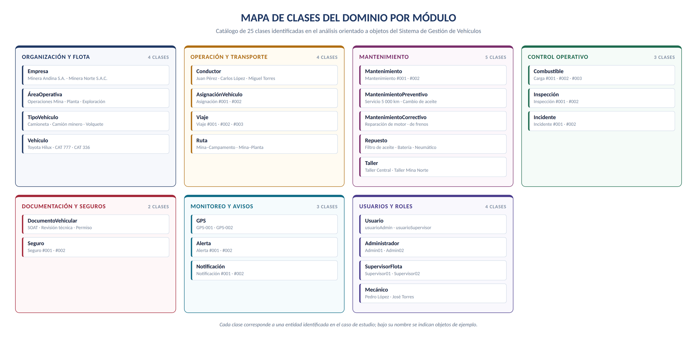
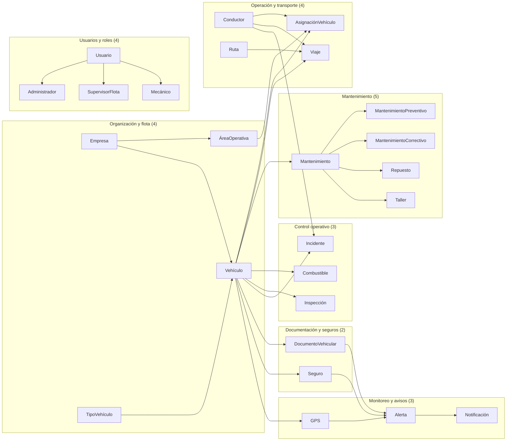
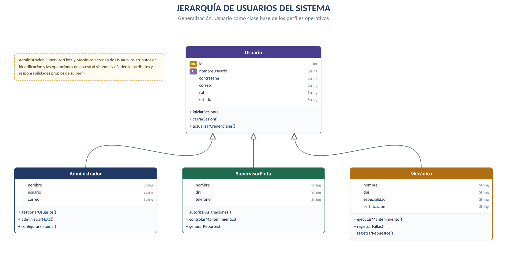
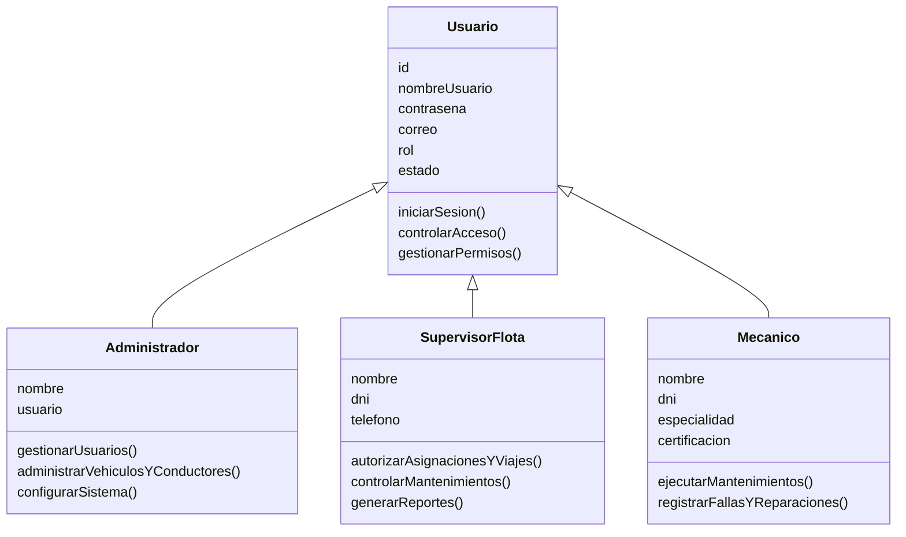
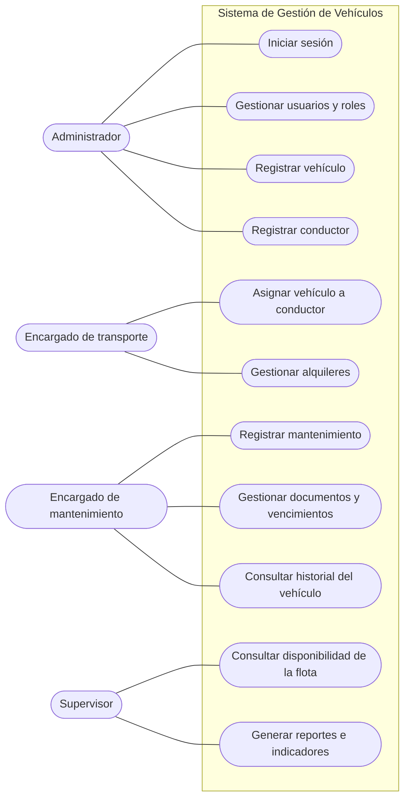

# Catálogo de clases, objetos y responsabilidades

> Parte del proyecto [Sistema de Gestión de Flota Vehicular](../README.md) · Documento original en Word: [`03 - Catalogo de clases objetos y responsabilidades.docx`](../originales/03%20-%20Catalogo%20de%20clases%20objetos%20y%20responsabilidades.docx)

---

**GERENCIA REGIONAL DE EDUCACIÓN LA LIBERTAD**

INSTITUTO DE EDUCACIÓN SUPERIOR TECNOLÓGICO PÚBLICO

**“PAIJÁN”**

**IDENTIFICACIÓN DE CLASES — ANÁLISIS ORIENTADO A OBJETOS**

**CATÁLOGO DE CLASES, OBJETOS Y RESPONSABILIDADES**

**SISTEMA DE GESTIÓN DE VEHÍCULOS — EMPRESA MINERA**

*Identificación de entidades del dominio, atributos principales y responsabilidades asignadas*

Documento de apoyo al análisis orientado a objetos: 25 clases identificadas, agrupadas en siete módulos funcionales.

| **Unidad didáctica** | Programación Orientada a Objetos (POO) |
| --- | --- |
| **Semana / Sesión** | Semana 02 · SA2-POO-S2 |
| **Indicador de logro** | C4.I1 |
| **Docente** | Ing. Carlos Abilio Angulo Zegarra |
| **Alcance** | 25 clases · 7 módulos funcionales · catálogo de atributos y responsabilidades |
| **Método** | Identificación de clases a partir de sustantivos y responsabilidades del caso de estudio |

Paiján — La Libertad, Perú

**Septiembre de 2026**

## 1. Presentación

Este documento recoge el catálogo de clases identificadas durante el análisis orientado a objetos del Sistema de Gestión de Vehículos para una empresa minera. Para cada clase se indican objetos de ejemplo, los atributos principales que la describen y las responsabilidades que asume dentro del sistema.

El catálogo es el paso intermedio entre la descripción del problema y el diagrama de clases: permite verificar que cada entidad del dominio tiene una razón de existir, un conjunto de datos propio y un conjunto de operaciones que le corresponden. En total se identificaron veinticinco clases, agrupadas en siete módulos funcionales.

### 1.1 Criterio de identificación de clases

- Una clase representa una entidad del dominio con identidad propia, datos propios y responsabilidades propias.

- Los atributos listados son los que el caso de estudio requiere; no se incluyen atributos técnicos de implementación.

- Las responsabilidades se redactan como acciones que la clase debe garantizar, no como funciones de interfaz.

- Los objetos de ejemplo son instancias concretas que ayudan a validar que la clase está bien delimitada.

- Cuando varias clases comparten atributos y operaciones de acceso, se modela una clase base y sus especializaciones (véase la sección 4).

### 1.2 Resumen por módulo

| **Módulo** | **N.º de clases** | **Clases que lo integran** |
| --- | --- | --- |
| **Organización y flota** | 4 | Empresa · ÁreaOperativa · TipoVehículo · Vehículo |
| **Operación y transporte** | 4 | Conductor · AsignaciónVehículo · Viaje · Ruta |
| **Mantenimiento** | 5 | Mantenimiento · MantenimientoPreventivo · MantenimientoCorrectivo · Repuesto · Taller |
| **Control operativo** | 3 | Combustible · Inspección · Incidente |
| **Documentación y seguros** | 2 | DocumentoVehicular · Seguro |
| **Monitoreo y avisos** | 3 | GPS · Alerta · Notificación |
| **Usuarios y roles** | 4 | Usuario · Administrador · SupervisorFlota · Mecánico |
| **Total** | 25 | — |

El mapa de la página siguiente muestra esta misma distribución de forma visual.

*Figura 1. Mapa de clases del dominio agrupadas por módulo funcional.*

Versión en Mermaid de la Figura 1 (texto editable)

## 2. Catálogo de clases por módulo

### 2.1 Organización y flota

| **Clase** | **Objetos de ejemplo** | **Atributos principales** | **Responsabilidades** |
| --- | --- | --- | --- |
| **Empresa** | Minera Andina S.A. · Minera Norte S.A.C. | id, razonSocial, ruc, direccion, telefono, correo | Registrar empresas mineras; gestionar información empresarial; asociar vehículos y conductores; consultar información de la flota. |
| **ÁreaOperativa** | Operaciones Mina · Planta · Exploración · Mantenimiento | id, nombre, descripcion, ubicacion | Registrar áreas; asignar vehículos; controlar recursos vehiculares; consultar vehículos disponibles por área. |
| **TipoVehículo** | Camioneta · Camión minero · Excavadora · Volquete · Bus | id, nombre, descripcion, capacidad | Registrar tipos de vehículos; definir características; clasificar vehículos; facilitar búsquedas por categoría. |
| **Vehículo** | Camioneta Toyota Hilux · Camión minero CAT 777 · Excavadora CAT 336 | id, placa, marca, modelo, año, tipo, capacidad, kilometraje, estado, empresaId | Registrar vehículos; actualizar kilometraje y estado; consultar disponibilidad; controlar el estado operativo; asociar mantenimientos, conductores y asignaciones. |

### 2.2 Operación y transporte

| **Clase** | **Objetos de ejemplo** | **Atributos principales** | **Responsabilidades** |
| --- | --- | --- | --- |
| **Conductor** | Juan Pérez · Carlos López · Miguel Torres | id, nombre, dni, licencia, categoriaLicencia, telefono, correo, estado | Registrar conductores; validar licencia; asociar conductores con vehículos; consultar historial de viajes e incidentes; controlar la vigencia de la licencia. |
| **AsignaciónVehículo** | Asignación #001 · Asignación #002 | id, fechaInicio, fechaFin, motivo, estado, vehiculoId, conductorId, areaId | Asignar vehículos; registrar fechas y motivo; controlar asignaciones; evitar duplicidades; mantener el historial de asignaciones. |
| **Viaje** | Viaje #001 · #002 · #003 | id, fechaSalida, fechaLlegada, origen, destino, kilometrajeInicial, kilometrajeFinal, estado, vehiculoId, conductorId | Registrar viajes; registrar origen y destino; controlar kilometraje; asociar viajes con conductores y vehículos; mantener el historial de desplazamientos. |
| **Ruta** | Mina–Campamento · Mina–Planta · Almacén–Mina | id, nombre, origen, destino, distancia, tiempoEstimado, estado | Registrar rutas; definir origen y destino; establecer distancia y tiempo; asociar rutas con viajes; controlar rutas habilitadas. |

### 2.3 Mantenimiento

| **Clase** | **Objetos de ejemplo** | **Atributos principales** | **Responsabilidades** |
| --- | --- | --- | --- |
| **Mantenimiento** | Mantenimiento #001 · #002 | id, fechaSolicitud, fechaInicio, fechaFin, tipo, descripcion, costo, estado, vehiculoId | Registrar mantenimientos; programar servicios; registrar trabajos y costos; actualizar el estado del vehículo; mantener el historial. |
| **MantenimientoPreventivo** | Servicio 5 000 km · Cambio de aceite · Revisión general | id, kilometrajeProgramado, fechaProgramada, actividades, costoEstimado, estado | Programar mantenimientos preventivos; registrar actividades; generar alertas; reducir el riesgo de fallas. |
| **MantenimientoCorrectivo** | Reparación de motor · Cambio de transmisión · Reparación de frenos | id, fallaDetectada, fechaReporte, fechaReparacion, diagnostico, costo, estado | Registrar fallas; registrar diagnósticos y reparaciones; controlar costos; registrar el tiempo fuera de servicio. |
| **Repuesto** | Filtro de aceite · Pastillas de freno · Batería · Neumático | id, codigo, nombre, descripcion, cantidad, precio, stockMinimo | Registrar repuestos; controlar el inventario; registrar repuestos utilizados; generar alertas de stock; consultar disponibilidad. |
| **Taller** | Taller Central · Taller Mina Norte · Taller Externo | id, nombre, direccion, telefono, tipo, estado | Registrar talleres; gestionar servicios; asociar talleres con mantenimientos; consultar disponibilidad. |

### 2.4 Control operativo

| **Clase** | **Objetos de ejemplo** | **Atributos principales** | **Responsabilidades** |
| --- | --- | --- | --- |
| **Combustible** | Carga #001 · #002 · #003 | id, fecha, tipoCombustible, cantidad, precioUnitario, costoTotal, kilometraje, vehiculoId | Registrar cargas; controlar consumo y costos; asociar consumos con vehículos; calcular el rendimiento; detectar consumos anormales. |
| **Inspección** | Inspección #001 · #002 | id, fecha, tipo, kilometraje, resultado, observaciones, estado, vehiculoId, conductorId | Realizar inspecciones; registrar condiciones mecánicas; detectar riesgos; determinar si el vehículo está apto; registrar observaciones. |
| **Incidente** | Incidente #001 · #002 | id, fecha, tipo, descripcion, gravedad, ubicacion, estado, vehiculoId, conductorId | Registrar accidentes y averías; clasificar la gravedad; registrar la ubicación; gestionar la resolución; mantener el historial de incidentes. |

### 2.5 Documentación y seguros

| **Clase** | **Objetos de ejemplo** | **Atributos principales** | **Responsabilidades** |
| --- | --- | --- | --- |
| **DocumentoVehicular** | SOAT #001 · Revisión Técnica #002 · Permiso #003 | id, tipo, numero, fechaEmision, fechaVencimiento, estado, vehiculoId | Registrar documentos; controlar vencimientos; generar alertas; mantener la documentación actualizada. |
| **Seguro** | Seguro #001 · #002 | id, numeroPoliza, aseguradora, fechaInicio, fechaVencimiento, cobertura, costo, estado, vehiculoId | Registrar seguros; controlar vigencia y cobertura; generar alertas; consultar las pólizas de cada vehículo. |

### 2.6 Monitoreo y avisos

| **Clase** | **Objetos de ejemplo** | **Atributos principales** | **Responsabilidades** |
| --- | --- | --- | --- |
| **GPS** | GPS-001 · GPS-002 | id, numeroSerie, latitud, longitud, velocidad, fechaHora, estado, vehiculoId | Registrar la ubicación; monitorear vehículos; registrar velocidad y posición; mantener el historial; controlar desplazamientos. |
| **Alerta** | Alerta #001 · #002 | id, tipo, mensaje, fecha, prioridad, estado, vehiculoId | Generar alertas de mantenimiento; informar vencimientos; alertar sobre incidentes y fallas; registrar la atención de cada alerta. |
| **Notificación** | Notificación #001 · #002 | id, mensaje, fecha, tipo, destinatario, estado | Enviar recordatorios; notificar vencimientos; informar incidentes y alertas; notificar asignaciones; registrar el estado de envío. |

### 2.7 Usuarios y roles

| **Clase** | **Objetos de ejemplo** | **Atributos principales** | **Responsabilidades** |
| --- | --- | --- | --- |
| **Usuario** | usuarioAdmin · usuarioSupervisor · usuarioOperador | id, nombreUsuario, contrasena, correo, rol, estado | Gestionar el inicio de sesión; controlar el acceso; gestionar permisos; actualizar credenciales; servir como clase base de los usuarios. |
| **Administrador** | Admin01 · Admin02 | id, nombre, usuario, contrasena, correo | Gestionar usuarios; administrar vehículos y conductores; gestionar áreas y tipos de vehículo; consultar reportes; configurar el sistema. |
| **SupervisorFlota** | Supervisor01 · Supervisor02 | id, nombre, dni, telefono, usuario | Supervisar la flota; autorizar asignaciones y viajes; controlar mantenimientos e inspecciones; revisar el consumo de combustible; generar reportes. |
| **Mecánico** | Pedro López · José Torres | id, nombre, dni, especialidad, telefono, certificacion | Ejecutar mantenimientos; registrar fallas y reparaciones; registrar los repuestos utilizados; actualizar el estado del vehículo; informar problemas. |

## 3. Relaciones principales entre clases

El catálogo anterior describe cada clase por separado. La siguiente tabla resume cómo se conectan entre sí, lo que permite pasar del catálogo al diagrama de clases.

| **Clase origen** | **Se relaciona con** | **Naturaleza de la relación** |
| --- | --- | --- |
| **Empresa** | ÁreaOperativa, Vehículo | Una empresa agrupa varias áreas operativas y toda la flota. |
| **ÁreaOperativa** | Vehículo, AsignaciónVehículo | Cada área dispone de vehículos asignados para su operación. |
| **TipoVehículo** | Vehículo | Clasifica a cada unidad y define sus características generales. |
| **Vehículo** | Casi todas las clases operativas | Es la clase central del dominio: concentra asignaciones, viajes, mantenimientos, combustible, documentos, seguros, inspecciones, incidentes, GPS y alertas. |
| **Conductor** | AsignaciónVehículo, Viaje, Incidente | Opera las unidades asignadas y queda vinculado a viajes e incidentes. |
| **AsignaciónVehículo** | Vehículo, Conductor, ÁreaOperativa | Relaciona las tres entidades durante un periodo determinado. |
| **Viaje** | Ruta, Vehículo, Conductor | Ejecuta una ruta con un vehículo y un conductor concretos. |
| **Mantenimiento** | MantenimientoPreventivo, MantenimientoCorrectivo, Repuesto, Taller | Se especializa en preventivo y correctivo, consume repuestos y se ejecuta en un taller. |
| **DocumentoVehicular, Seguro** | Alerta, Notificación | Sus fechas de vencimiento generan alertas y notificaciones. |
| **GPS** | Vehículo, Alerta | Aporta la posición de la unidad y puede disparar alertas. |
| **Usuario** | Administrador, SupervisorFlota, Mecánico | Clase base de la que heredan los tres perfiles operativos. |

## 4. Jerarquía de usuarios

Administrador, SupervisorFlota y Mecánico comparten los atributos de identificación y las operaciones de acceso al sistema. Por ello se modela Usuario como clase base y los tres perfiles como especializaciones que añaden únicamente lo que les es propio. Esta decisión evita repetir los mismos atributos en tres clases distintas y centraliza el control de acceso.

*Figura 2. Jerarquía de usuarios: Usuario como clase base de Administrador, SupervisorFlota y Mecánico.*

Versión en Mermaid de la Figura 2 (texto editable)

## 5. Alcance funcional asociado al catálogo

Las clases identificadas dan soporte a las funciones que los distintos perfiles ejecutan en el sistema. El diagrama de casos de uso de la página siguiente resume ese alcance funcional.

*Figura 3. Diagrama de casos de uso asociado al catálogo de clases.*

Versión en Mermaid de la Figura 3 (texto editable)

## 6. Observaciones sobre el catálogo

- Vehículo es la clase con mayor número de relaciones del modelo; conviene vigilar que no acumule responsabilidades que corresponden a otras clases.

- MantenimientoPreventivo y MantenimientoCorrectivo especializan a Mantenimiento: comparten vehículo, fechas y costo, y se diferencian por la información propia de cada tipo.

- Alerta y Notificación se mantienen separadas porque responden a necesidades distintas: la alerta es una condición detectada por el sistema y la notificación es su envío a un destinatario.

- GPS y Seguro corresponden a capacidades que pueden implementarse en una fase posterior; se mantienen en el catálogo para que el modelo las contemple desde el inicio.

- Los nombres de clase se escriben en singular y en notación PascalCase, y los atributos en camelCase, siguiendo la convención habitual en programación orientada a objetos.

## 7. Conclusión

El catálogo permite comprobar que cada clase del sistema tiene una razón de existir dentro del caso de estudio, un conjunto de atributos que la describe y un conjunto de responsabilidades que le corresponde. Agrupadas en siete módulos funcionales, las veinticinco clases cubren el ciclo completo de la gestión de una flota minera: organización, operación, mantenimiento, control, documentación, monitoreo y seguridad de acceso.

Con esta base, el paso siguiente del análisis es el diagrama de clases definitivo, en el que se fijan cardinalidades, tipos de datos y operaciones, y a partir de él el modelo lógico de la base de datos.

> **Nota sobre los datos de ejemplo** Las empresas, placas, talleres y nombres de personas que aparecen como objetos de ejemplo son ilustrativos y fueron construidos para el caso de estudio: no corresponden a organizaciones ni a personas reales.
