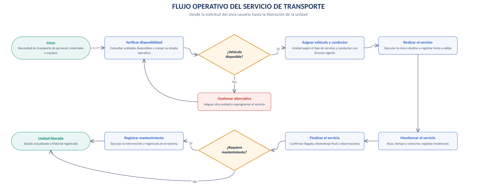
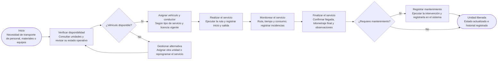
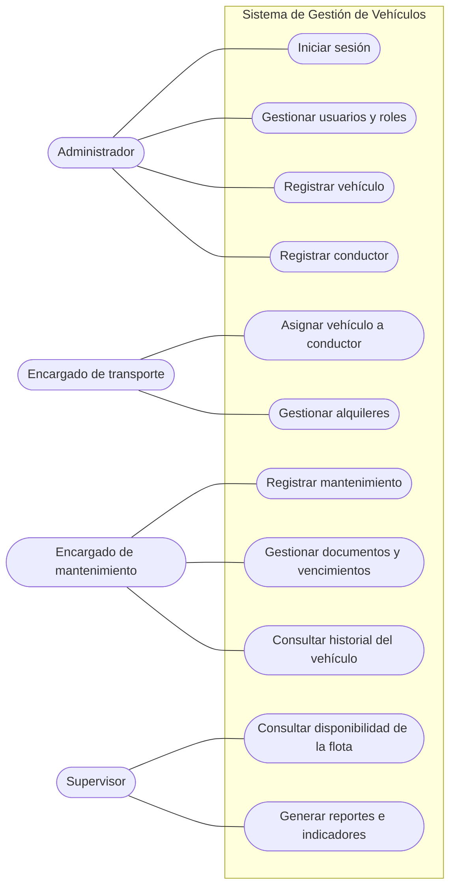
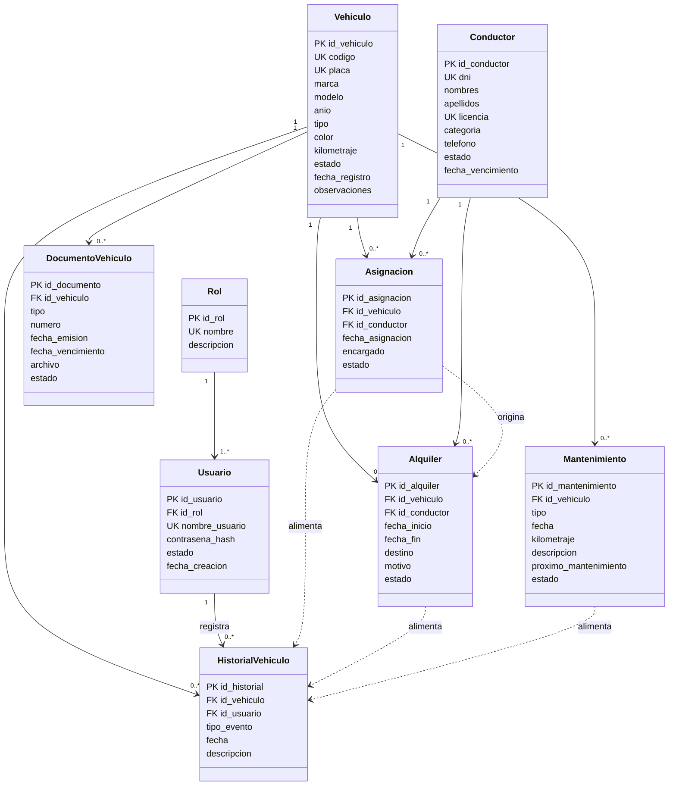
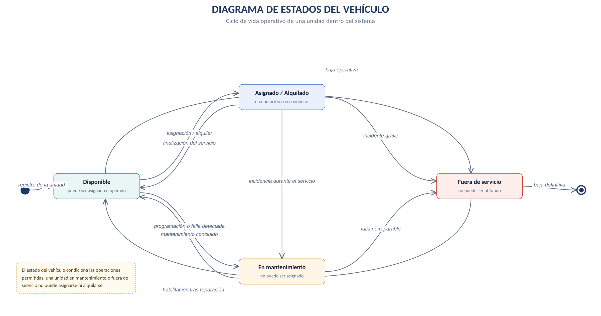
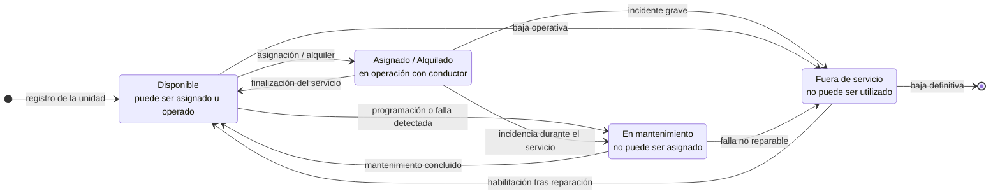
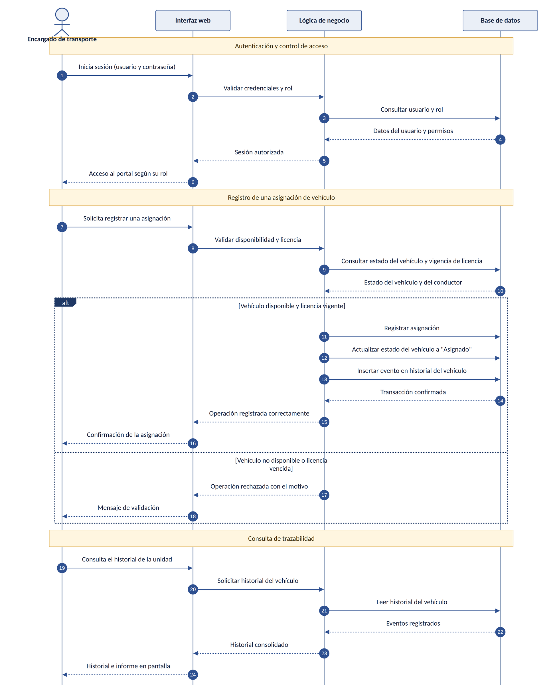
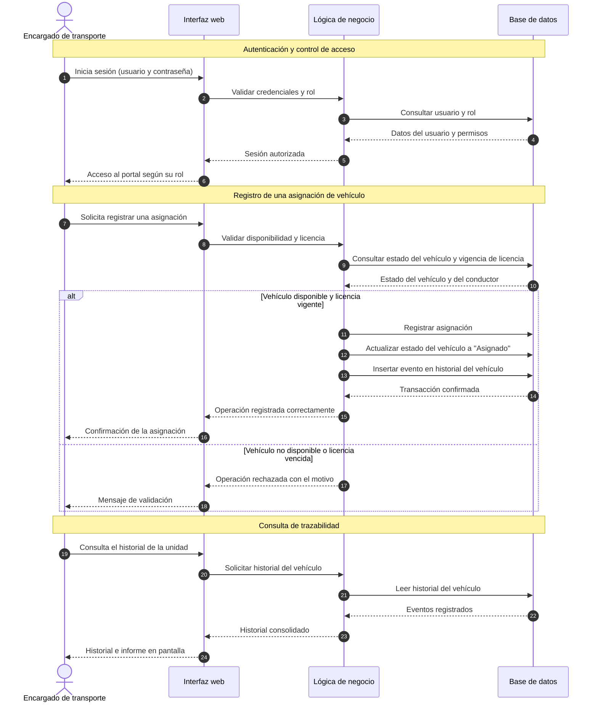
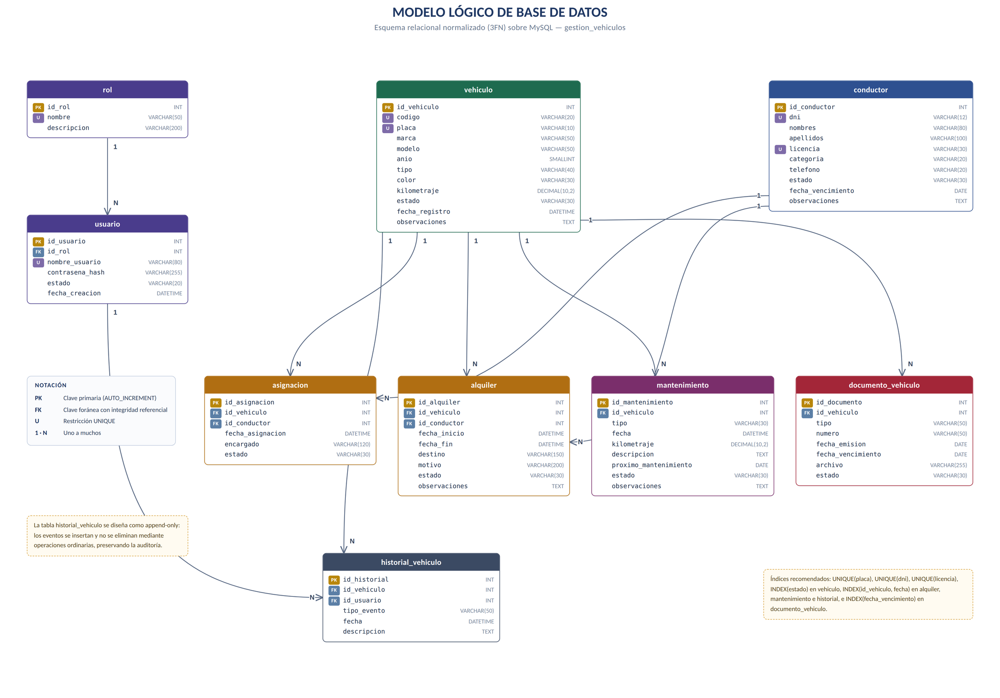
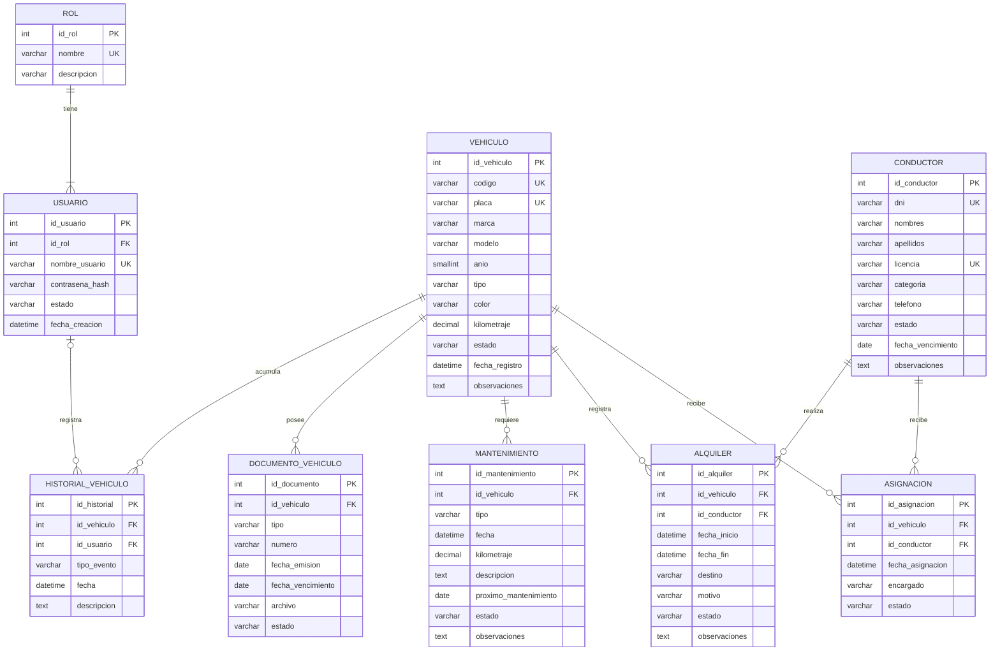

# Sistema de Gestión de Vehículos — análisis orientado a objetos y base de datos

> Parte del proyecto [Sistema de Gestión de Flota Vehicular](../README.md) · Documento original en Word: [`04 - Sistema de Gestion de Vehiculos - analisis OO y base de datos.docx`](../originales/04%20-%20Sistema%20de%20Gestion%20de%20Vehiculos%20-%20analisis%20OO%20y%20base%20de%20datos.docx)

---

**GERENCIA REGIONAL DE EDUCACIÓN LA LIBERTAD**

INSTITUTO DE EDUCACIÓN SUPERIOR TECNOLÓGICO PÚBLICO

**“PAIJÁN”**

**CASO DE ESTUDIO APLICADO**

**SISTEMA DE GESTIÓN DE VEHÍCULOS PARA EMPRESA MINERA**

**ANÁLISIS ORIENTADO A OBJETOS Y DISEÑO DE BASE DE DATOS**

*Requerimientos, modelo conceptual, modelo lógico, propuesta económica y diseño técnico*

Documento integrado en dos partes: análisis orientado a objetos del caso de estudio y especificación técnica de la base de datos.

| **Unidad didáctica** | Programación Orientada a Objetos (POO) |
| --- | --- |
| **Semana / Sesión** | Semana 02 · SA2-POO-S2 |
| **Indicador de logro** | C4.I1 |
| **Docente** | Ing. Carlos Abilio Angulo Zegarra |
| **Estructura** | Parte I: análisis OO (secciones 1–15) · Parte II: diseño de base de datos (secciones 16–25) · Anexos |
| **Motor de base de datos** | MySQL 8 · utf8mb4_unicode_ci |

Paiján — La Libertad, Perú

**Septiembre de 2026**

## 1. Presentación

Este documento desarrolla el análisis orientado a objetos de un Sistema de Gestión de Vehículos para una empresa minera. El caso parte de una problemática real relacionada con la gestión y el control de las unidades utilizadas para el transporte de personal, materiales y equipos.

La propuesta aborda la identificación de entidades y sus responsabilidades, los requerimientos funcionales y no funcionales, la organización de los procesos y el modelo conceptual del sistema. Incorpora además una sección económica con la inversión estimada, los costos operativos y los beneficios esperados, y una segunda parte con el diseño técnico de la base de datos.

La finalidad es centralizar la información de vehículos, conductores, alquileres, asignaciones, mantenimientos, documentos, historial, usuarios y roles en una única fuente confiable.

> **Cómo está organizado este documento** Parte I (secciones 1 a 15): análisis orientado a objetos — problema, objetivos, procesos, actores, entidades, modelo conceptual, economía, reglas de negocio, requerimientos, módulos e indicadores. Parte II (secciones 16 a 25): diseño técnico de la base de datos — modelo lógico, relaciones, integridad, normalización, índices, script MySQL, consultas, seguridad, plan de implementación y criterios de aceptación. Anexos: los diagramas UML del sistema reunidos a página completa.

## 2. Planteamiento del problema y caso de estudio

### 2.1 Título del problema

> Deficiente gestión y control de los vehículos utilizados para el transporte de personal, materiales y equipos en una empresa minera, debido a la falta de una base de datos centralizada.

### 2.2 Situación actual

La información de vehículos, conductores, alquileres, mantenimientos y disponibilidad se registra mediante documentos físicos, hojas de cálculo o archivos separados. Esto dificulta conocer en tiempo real qué vehículos están disponibles, alquilados, en mantenimiento o fuera de servicio.

También se presentan dificultades para hacer seguimiento de los mantenimientos, controlar la asignación de vehículos a conductores y consultar el historial de uso de cada unidad. El manejo de información en archivos distintos ocasiona errores, duplicación de registros, pérdida de información y retrasos en la elaboración de reportes.

### 2.3 Problema central

La empresa necesita centralizar y administrar la información de la flota para mejorar el control de la disponibilidad, las asignaciones, los alquileres, los mantenimientos, los documentos y el historial.

### 2.4 Propuesta general

Desarrollar un sistema web de gestión de vehículos que permita centralizar la información de la flota, los conductores, los alquileres, los mantenimientos, los documentos, la disponibilidad, los usuarios y los reportes.

## 3. Análisis de causas y consecuencias

| **Causa** | **Consecuencia** | **Necesidad identificada** |
| --- | --- | --- |
| Información en documentos físicos, hojas de cálculo y archivos separados. | Dificultad para conocer la disponibilidad en tiempo real. | Centralizar la información en un sistema. |
| Registros distribuidos entre varias fuentes. | Errores, duplicidad y pérdida de información. | Base de datos que evite registros duplicados. |
| Seguimiento limitado de los mantenimientos. | Mayor dificultad para controlar intervenciones preventivas y correctivas. | Registrar mantenimientos e historial. |
| Asignaciones y alquileres dispersos. | Dificultad para controlar qué vehículo corresponde a cada conductor y periodo. | Gestionar asignaciones y alquileres. |
| Reportes elaborados desde archivos distintos. | Retrasos en la consulta y en la toma de decisiones. | Generar reportes de vehículos, alquileres, mantenimientos y disponibilidad. |

### 3.1 Relación causa – problema – consecuencia

Causas principales: información descentralizada, registros separados y falta de control integrado. Problema: gestión deficiente de la flota vehicular. Consecuencias: errores, duplicidad, pérdida de información, retrasos y dificultad para conocer la disponibilidad de las unidades.

## 4. Objetivos y alcance

### 4.1 Objetivo general

> Aplicar el análisis orientado a objetos al Sistema de Gestión de Vehículos para una empresa minera, identificando entidades, responsabilidades y requerimientos para estructurar una solución que centralice la gestión de la flota.

### 4.2 Objetivos específicos

- Identificar las entidades principales del dominio y sus atributos.

- Definir las responsabilidades de cada entidad y sus relaciones.

- Establecer los requerimientos funcionales y no funcionales.

- Controlar vehículos, conductores, alquileres, asignaciones y mantenimientos.

- Centralizar documentos, historial, usuarios y roles.

- Generar reportes sobre vehículos, alquileres, mantenimientos y disponibilidad.

### 4.3 Alcance

El alcance comprende la gestión de vehículos, conductores, alquileres, asignaciones, mantenimientos, documentos, historial, usuarios, roles, disponibilidad, seguridad de acceso y generación de reportes.

## 5. Procesos y esquema general del negocio

Los procesos identificados en el caso son: registro de vehículos y conductores; asignación de vehículo a conductor; gestión de alquileres; registro y control de mantenimientos preventivos y correctivos; control de disponibilidad y estado de la flota; y generación de reportes.

| **Proceso** | **Entrada** | **Actividad principal** | **Salida** |
| --- | --- | --- | --- |
| **Registro de vehículos y conductores** | Datos de vehículos y conductores | Registrar y actualizar la información | Información disponible en el sistema |
| **Asignación** | Vehículo disponible y conductor | Vincular vehículo con conductor | Asignación registrada |
| **Alquiler** | Vehículo, conductor y periodo | Registrar inicio y finalización o cancelación | Alquiler controlado |
| **Mantenimiento** | Datos de la intervención | Registrar preventivo o correctivo y programar el próximo | Historial de mantenimiento |
| **Disponibilidad** | Estado de cada unidad | Controlar disponible, alquilado, en mantenimiento o fuera de servicio | Estado actualizado |
| **Reportes** | Datos centralizados | Consultar y consolidar la información | Reportes de gestión |

### 5.1 Flujo operativo del servicio de transporte

El diagrama de la página siguiente representa el recorrido completo de una solicitud de transporte: desde la necesidad del área usuaria hasta la liberación de la unidad, incluyendo el desvío hacia mantenimiento cuando corresponde.



*Figura 1. Flujo operativo del servicio de transporte, desde la solicitud del área usuaria hasta la liberación de la unidad.*

<details>
<summary>Versión en Mermaid de la Figura 1 (texto editable)</summary>



</details>

## 6. Actores y casos de uso

| **Actor** | **Participación en el sistema** | **Casos de uso principales** |
| --- | --- | --- |
| **Administrador** | Gestiona la información y los accesos. | Gestionar vehículos, conductores, alquileres, usuarios, roles y reportes. |
| **Encargado de transporte** | Controla las operaciones de la flota. | Gestionar vehículos, asignaciones, alquileres y consultas. |
| **Encargado de mantenimiento** | Controla las intervenciones técnicas y los documentos. | Registrar mantenimientos, controlar documentos y consultar reportes. |
| **Supervisor** | Consulta y supervisa la información. | Consultar disponibilidad, vehículos e información de gestión. |

### 6.1 Esquema conceptual de casos de uso

El diagrama delimita qué funciones ofrece el sistema y qué perfil es responsable de cada una. Todos los actores acceden mediante autenticación y las funciones disponibles dependen del rol asignado.


*Figura 2. Diagrama de casos de uso del Sistema de Gestión de Vehículos.*

<details>
<summary>Versión en Mermaid de la Figura 2 (texto editable)</summary>



</details>

## 7. Catálogo de entidades y responsabilidades

| **Entidad** | **Atributos principales** | **Responsabilidades** | **Relación** |
| --- | --- | --- | --- |
| **Vehículo** | Código, placa, marca, modelo, año, tipo, color, kilometraje, estado, fecha de registro, observaciones. | Registrar y actualizar datos; mantener el estado; conservar el historial. | Alquiler, Mantenimiento, Documento, Historial. |
| **Conductor** | DNI, nombres, apellidos, licencia, categoría, teléfono, estado, vencimiento, observaciones. | Registrar y actualizar datos; ser asignado; conducir en alquiler. | Alquiler, Asignación. |
| **Alquiler** | Número, vehículo, conductor, inicio, finalización, destino, motivo, estado, observaciones. | Registrar el uso por periodo; controlar el estado; actualizar la disponibilidad. | Vehículo, Conductor, Historial. |
| **Asignación** | Vehículo, conductor, fecha, encargado, estado. | Vincular un vehículo disponible a un conductor; cambiar el estado. | Vehículo, Conductor; origina Alquiler. |
| **Mantenimiento** | Vehículo, tipo, fecha, kilometraje, descripción, próximo mantenimiento, estado, observaciones. | Registrar intervenciones; actualizar el estado; programar el próximo mantenimiento. | Vehículo, Historial. |
| **Documento del vehículo** | Vehículo, tipo, número, emisión, vencimiento, archivo adjunto. | Almacenar documentos; alertar sobre vencimientos. | Vehículo. |
| **Historial del vehículo** | Vehículo, tipo de evento, fecha, descripción, usuario responsable. | Consolidar los eventos de forma cronológica. | Alquiler, Asignación, Mantenimiento. |
| **Usuario** | Nombre de usuario, contraseña, rol, estado, fecha de creación. | Iniciar y cerrar sesión; operar según su rol; auditoría. | Rol y registro de actividades. |
| **Rol** | Nombre del rol, permisos asociados. | Definir las funciones y los accesos permitidos. | Uno o varios Usuarios. |

## 8. Esquema de relaciones y modelo conceptual

El modelo conceptual representa las entidades identificadas en el caso y sus relaciones principales. El esquema sirve como base para la implementación de la base de datos y del sistema web.

### 8.1 Relaciones principales

- Vehículo se relaciona con Alquiler, Mantenimiento, Documento e Historial.

- Conductor se relaciona con Alquiler y Asignación.

- Asignación relaciona Vehículo con Conductor y da origen al Alquiler.

- Alquiler genera registros en el Historial.

- Mantenimiento alimenta el Historial.

- Usuario se relaciona con Rol y con el registro de actividades.

### 8.2 Modelo conceptual de clases

El diagrama de la página siguiente muestra las nueve clases del modelo conceptual con sus atributos, claves y cardinalidades.


*Figura 3. Modelo conceptual de clases del Sistema de Gestión de Vehículos.*

<details>
<summary>Versión en Mermaid de la Figura 3 (texto editable)</summary>



</details>

### 8.3 Composición conceptual de la información

La información de una unidad se organiza alrededor de Vehículo, vinculando sus alquileres, asignaciones, mantenimientos, documentos e historial. Esto permite consultar toda la información de la unidad de manera centralizada, sin recorrer archivos separados.

## 9. Control de costos, pagos e información económica

> **Carácter de las cifras** Los montos son estimaciones referenciales para un sistema web con el alcance descrito. El monto final depende de la cotización del proveedor, del número de usuarios y de las integraciones requeridas.

| **Etapa** | **Descripción** | **Inversión estimada** |
| --- | --- | --- |
| **1. Análisis y diseño** | Levantamiento de requerimientos, diseño del modelo de datos y de la interfaz. | S/ 3 000 – S/ 5 000 |
| **2. Desarrollo** | Módulos de vehículos, conductores, alquileres, mantenimientos, documentos, reportes y seguridad. | S/ 15 000 – S/ 25 000 |
| **3. Pruebas e implementación** | Pruebas funcionales, migración de datos y puesta en producción. | S/ 3 000 – S/ 5 000 |
| **4. Capacitación** | Capacitación a administrador, transporte, mantenimiento y supervisor. | S/ 2 000 – S/ 3 000 |
| **Inversión total estimada** | Desarrollo completo del sistema. | S/ 23 000 – S/ 38 000 |

### 9.1 Costos operativos recurrentes

| **Concepto** | **Estimado** |
| --- | --- |
| **Hosting o servidor en la nube** | S/ 150 – S/ 400 / mes |
| **Soporte y mantenimiento del sistema** | S/ 4 000 – S/ 7 000 / año |
| **Licencias adicionales** | Según proveedor |

### 9.2 Beneficios esperados y retorno

- Reducción del tiempo dedicado a búsquedas y a la consolidación manual de información.

- Menor incidencia de mantenimientos correctivos costosos gracias al seguimiento preventivo.

- Reducción de errores y de duplicidad de registros.

- Mejor control de los vencimientos documentarios.

- Reportes disponibles en tiempo real para las decisiones de gerencia y supervisión.

Se estima un periodo de retorno de la inversión (payback) de 8 a 14 meses desde la puesta en producción, dependiendo del tamaño de la flota gestionada.

## 10. Reglas de negocio y estados del vehículo

### 10.1 Reglas de negocio

- El estado del vehículo debe reflejar su condición operativa: disponible, alquilado, en mantenimiento o fuera de servicio.

- Una asignación vincula un vehículo disponible con un conductor.

- El mantenimiento debe registrar tipo, fecha, kilometraje, descripción y próximo mantenimiento.

- Los documentos del vehículo deben almacenar la fecha de vencimiento para facilitar su control.

- El acceso al sistema se realiza mediante usuario y rol.

- La base de datos debe evitar registros duplicados.

### 10.2 Diagrama de estados del vehículo

El estado de la unidad condiciona las operaciones permitidas: una unidad en mantenimiento o fuera de servicio no puede asignarse ni alquilarse. El diagrama de la página siguiente representa el ciclo de vida completo.



*Figura 4. Diagrama de estados del vehículo dentro del sistema.*

<details>
<summary>Versión en Mermaid de la Figura 4 (texto editable)</summary>



</details>

### 10.3 Secuencia conceptual de atención

El flujo general parte de la autenticación del usuario, continúa con el registro o la consulta de una operación de la flota, actualiza la disponibilidad del vehículo, registra el evento en el historial y devuelve la confirmación o la información solicitada. El diagrama de secuencia de la página siguiente detalla ese intercambio entre el usuario, la interfaz, la lógica de negocio y la base de datos.



*Figura 5. Diagrama de secuencia conceptual: autenticación, registro de una asignación y consulta de trazabilidad.*

<details>
<summary>Versión en Mermaid de la Figura 5 (texto editable)</summary>



</details>

## 11. Requerimientos del sistema

### 11.1 Requerimientos funcionales

| **ID** | **Descripción** | **Prioridad** | **Entidades relacionadas** |
| --- | --- | --- | --- |
| **RF-01** | Registrar, modificar, consultar y buscar vehículos. | Alta | Vehículo |
| **RF-02** | Registrar y gestionar la información de conductores. | Alta | Conductor |
| **RF-03** | Registrar alquileres, asignar vehículo a conductor y finalizar o cancelar el alquiler. | Alta | Alquiler, Asignación, Vehículo, Conductor |
| **RF-04** | Registrar el estado del vehículo y controlar su disponibilidad. | Alta | Vehículo |
| **RF-05** | Registrar mantenimientos preventivos y correctivos y consultar su historial. | Media | Mantenimiento, Vehículo, Historial |
| **RF-06** | Generar reportes de vehículos, alquileres, mantenimientos y disponibilidad. | Media | Vehículo, Alquiler, Mantenimiento |

### 11.2 Requerimientos no funcionales

| **ID** | **Descripción** | **Prioridad** |
| --- | --- | --- |
| **RNF-01** | Proteger la información mediante autenticación y permisos según el rol. | Alta |
| **RNF-02** | Ejecutar consultas y registros con rapidez y evitar registros duplicados para mantener la integridad. | Media |

### 11.3 Matriz de prioridad

| **Prioridad** | **Interpretación** | **Aplicación en el caso** |
| --- | --- | --- |
| **Alta** | Requisito prioritario para el funcionamiento y el control principal. | Vehículos, conductores, alquileres, disponibilidad y seguridad. |
| **Media** | Requisito importante para completar la gestión y mejorar el sistema. | Mantenimientos, reportes, rendimiento e integridad. |

## 12. Módulos y reportes propuestos

| **Módulo** | **Funciones principales** | **Información relacionada** |
| --- | --- | --- |
| **Vehículos** | Registrar, actualizar, consultar y buscar unidades; controlar estado y disponibilidad. | Vehículo |
| **Conductores** | Registrar y gestionar la información del personal habilitado. | Conductor |
| **Alquileres y asignaciones** | Registrar periodos, asignar vehículo y controlar el estado. | Alquiler, Asignación, Vehículo, Conductor |
| **Mantenimiento** | Registrar preventivos y correctivos y consultar el historial. | Mantenimiento, Historial |
| **Documentos** | Almacenar documentos y controlar vencimientos. | Documento del vehículo |
| **Usuarios y roles** | Autenticación, permisos y control de acceso. | Usuario, Rol |
| **Reportes** | Generar información sobre flota, alquileres, mantenimientos y disponibilidad. | Vehículo, Alquiler, Mantenimiento |

## 13. Indicadores de gestión

| **Indicador** | **Cálculo o fuente** | **Utilidad** |
| --- | --- | --- |
| **Disponibilidad de vehículos** | Estado registrado de cada unidad. | Conocer qué vehículos están disponibles, alquilados, en mantenimiento o fuera de servicio. |
| **Mantenimientos** | Registros de mantenimiento preventivo y correctivo. | Controlar las intervenciones y los próximos mantenimientos. |
| **Vencimientos documentarios** | Fechas de vencimiento almacenadas en los documentos. | Disminuir el riesgo de operar unidades no habilitadas. |
| **Alquileres** | Registros de inicio, finalización, cancelación y estado. | Controlar el uso de los vehículos. |
| **Reportes** | Información centralizada del sistema. | Apoyar las decisiones de gerencia y supervisión. |

## 14. Bitácora de uso de inteligencia artificial

Se declara el uso de herramientas de inteligencia artificial durante la elaboración del análisis, indicando la consulta realizada, la propuesta obtenida y la decisión adoptada por el equipo.

| **Herramienta** | **Consulta realizada** | **Propuesta obtenida** | **Decisión del equipo** |
| --- | --- | --- | --- |
| **Claude (Anthropic)** | Contrastar el catálogo de entidades del sistema de gestión de vehículos. | Incorporar Documento del vehículo e Historial del vehículo como clases independientes. | Se acepta, porque el informe contempla el registro de documentos y la consulta del historial. |
| **Claude (Anthropic)** | Revisar la cobertura de los requerimientos no funcionales. | Mantener seguridad, autenticación, roles, rendimiento e integridad. | Se acepta y se ajusta la redacción de RNF-01 y RNF-02. |
| **Claude (Anthropic)** | Revisar la presentación del documento y de los diagramas UML. | Unificar la notación de los diagramas, normalizar las tablas y estructurar el documento en dos partes. | Se acepta; el contenido técnico del caso se mantiene sin cambios de fondo. |

## 15. Conclusiones y próximos pasos

El Sistema de Gestión de Vehículos permitirá centralizar la gestión de la flota vehicular, reducir errores operativos y disponer de información confiable para la toma de decisiones.

La propuesta integra las entidades principales del dominio, sus responsabilidades, los requerimientos funcionales y no funcionales, los procesos, los estados, la seguridad, los reportes y una estimación económica.

Como próximos pasos se recomienda validar el alcance final con las áreas de transporte y mantenimiento, definir el número de usuarios que operarán el sistema y solicitar la cotización formal al equipo de desarrollo para confirmar la inversión definitiva.

### 15.1 Cronograma tentativo

| **Etapa** | **Duración estimada** |
| --- | --- |
| **Análisis y diseño** | 2 semanas |
| **Desarrollo** | 6 – 8 semanas |
| **Pruebas e implementación** | 2 semanas |
| **Capacitación y puesta en marcha** | 1 semana |

## 16. Modelo lógico de base de datos

> **Parte II — Diseño técnico de la base de datos** Esta sección transforma el modelo conceptual del documento en una especificación técnica orientada a su implementación en MySQL. Los nombres y las reglas se mantienen alineados con el caso de estudio original; las decisiones técnicas añadidas se presentan como propuesta.

El modelo lógico organiza la información en tablas normalizadas, identificando claves primarias (PK), claves foráneas (FK), restricciones de unicidad y relaciones entre las entidades. El esquema completo se muestra a página completa a continuación.



*Figura 6. Modelo lógico de base de datos (esquema relacional normalizado sobre MySQL).*

<details>
<summary>Versión en Mermaid de la Figura 6 (texto editable)</summary>



</details>

### 16.1 Tabla VEHICULO

| **Campo** | **Tipo** | **Restricción** | **Descripción** |
| --- | --- | --- | --- |
| **id_vehiculo** | INT | PK | Identificador interno |
| **codigo** | VARCHAR(20) | UNIQUE | Código interno de la unidad |
| **placa** | VARCHAR(10) | UNIQUE, NOT NULL | Placa del vehículo |
| **marca** | VARCHAR(50) | NOT NULL | Marca |
| **modelo** | VARCHAR(50) | NOT NULL | Modelo |
| **anio** | SMALLINT | NOT NULL | Año del vehículo |
| **tipo** | VARCHAR(40) | NOT NULL | Tipo de unidad |
| **color** | VARCHAR(30) | NULL | Color |
| **kilometraje** | DECIMAL(10,2) | NOT NULL | Kilometraje registrado |
| **estado** | VARCHAR(30) | NOT NULL | Disponible, alquilado, mantenimiento o fuera de servicio |
| **fecha_registro** | DATETIME | NOT NULL | Fecha de registro |
| **observaciones** | TEXT | NULL | Observaciones |

### 16.2 Tabla CONDUCTOR

| **Campo** | **Tipo** | **Restricción** | **Descripción** |
| --- | --- | --- | --- |
| **id_conductor** | INT | PK | Identificador interno |
| **dni** | VARCHAR(12) | UNIQUE, NOT NULL | Documento de identidad |
| **nombres** | VARCHAR(80) | NOT NULL | Nombres |
| **apellidos** | VARCHAR(100) | NOT NULL | Apellidos |
| **licencia** | VARCHAR(30) | UNIQUE, NOT NULL | Número de licencia |
| **categoria** | VARCHAR(20) | NOT NULL | Categoría |
| **telefono** | VARCHAR(20) | NULL | Teléfono |
| **estado** | VARCHAR(30) | NOT NULL | Estado del conductor |
| **fecha_vencimiento** | DATE | NOT NULL | Vencimiento de la licencia |
| **observaciones** | TEXT | NULL | Observaciones |

### 16.3 Tabla ALQUILER

| **Campo** | **Tipo** | **Restricción** | **Descripción** |
| --- | --- | --- | --- |
| **id_alquiler** | INT | PK | Identificador del alquiler |
| **id_vehiculo** | INT | FK, NOT NULL | Vehículo utilizado |
| **id_conductor** | INT | FK, NOT NULL | Conductor |
| **fecha_inicio** | DATETIME | NOT NULL | Inicio |
| **fecha_fin** | DATETIME | NULL | Finalización |
| **destino** | VARCHAR(150) | NOT NULL | Destino |
| **motivo** | VARCHAR(200) | NULL | Motivo |
| **estado** | VARCHAR(30) | NOT NULL | Activo, finalizado o cancelado |
| **observaciones** | TEXT | NULL | Observaciones |

### 16.4 Tabla ASIGNACION

| **Campo** | **Tipo** | **Restricción** | **Descripción** |
| --- | --- | --- | --- |
| **id_asignacion** | INT | PK | Identificador |
| **id_vehiculo** | INT | FK, NOT NULL | Vehículo |
| **id_conductor** | INT | FK, NOT NULL | Conductor |
| **fecha_asignacion** | DATETIME | NOT NULL | Fecha de la asignación |
| **encargado** | VARCHAR(120) | NULL | Responsable |
| **estado** | VARCHAR(30) | NOT NULL | Estado de la asignación |

### 16.5 Tabla MANTENIMIENTO

| **Campo** | **Tipo** | **Restricción** | **Descripción** |
| --- | --- | --- | --- |
| **id_mantenimiento** | INT | PK | Identificador |
| **id_vehiculo** | INT | FK, NOT NULL | Vehículo |
| **tipo** | VARCHAR(30) | NOT NULL | Preventivo o correctivo |
| **fecha** | DATETIME | NOT NULL | Fecha |
| **kilometraje** | DECIMAL(10,2) | NULL | Kilometraje |
| **descripcion** | TEXT | NOT NULL | Trabajo realizado |
| **proximo_mantenimiento** | DATE | NULL | Fecha programada |
| **estado** | VARCHAR(30) | NOT NULL | Programado, realizado o cancelado |
| **observaciones** | TEXT | NULL | Observaciones |

### 16.6 Tabla DOCUMENTO_VEHICULO

| **Campo** | **Tipo** | **Restricción** | **Descripción** |
| --- | --- | --- | --- |
| **id_documento** | INT | PK | Identificador |
| **id_vehiculo** | INT | FK, NOT NULL | Vehículo |
| **tipo** | VARCHAR(50) | NOT NULL | Tipo de documento |
| **numero** | VARCHAR(50) | NULL | Número |
| **fecha_emision** | DATE | NULL | Emisión |
| **fecha_vencimiento** | DATE | NULL | Vencimiento |
| **archivo** | VARCHAR(255) | NULL | Ruta o referencia al archivo |
| **estado** | VARCHAR(30) | NOT NULL | Vigente, próximo a vencer o vencido |

### 16.7 Tabla HISTORIAL_VEHICULO

| **Campo** | **Tipo** | **Restricción** | **Descripción** |
| --- | --- | --- | --- |
| **id_historial** | INT | PK | Identificador |
| **id_vehiculo** | INT | FK, NOT NULL | Vehículo |
| **tipo_evento** | VARCHAR(50) | NOT NULL | Tipo de evento |
| **fecha** | DATETIME | NOT NULL | Fecha |
| **descripcion** | TEXT | NOT NULL | Detalle |
| **id_usuario** | INT | FK, NULL | Usuario responsable |

### 16.8 Tabla ROL

| **Campo** | **Tipo** | **Restricción** | **Descripción** |
| --- | --- | --- | --- |
| **id_rol** | INT | PK | Identificador |
| **nombre** | VARCHAR(50) | UNIQUE, NOT NULL | Nombre del rol |
| **descripcion** | VARCHAR(200) | NULL | Descripción |

### 16.9 Tabla USUARIO

| **Campo** | **Tipo** | **Restricción** | **Descripción** |
| --- | --- | --- | --- |
| **id_usuario** | INT | PK | Identificador |
| **id_rol** | INT | FK, NOT NULL | Rol |
| **nombre_usuario** | VARCHAR(80) | UNIQUE, NOT NULL | Nombre de usuario |
| **contrasena_hash** | VARCHAR(255) | NOT NULL | Contraseña almacenada mediante hash |
| **estado** | VARCHAR(20) | NOT NULL | Activo o inactivo |
| **fecha_creacion** | DATETIME | NOT NULL | Fecha de creación |

## 17. Relaciones y cardinalidades

| **Relación** | **Cardinalidad** | **Regla** |
| --- | --- | --- |
| **Vehículo — Alquiler** | 1 : N | Un vehículo puede tener muchos alquileres históricos; cada alquiler corresponde a un vehículo. |
| **Conductor — Alquiler** | 1 : N | Un conductor puede registrar muchos alquileres; cada alquiler tiene un conductor. |
| **Vehículo — Asignación** | 1 : N | Una unidad puede tener varias asignaciones históricas. |
| **Conductor — Asignación** | 1 : N | Un conductor puede recibir varias asignaciones históricas. |
| **Vehículo — Mantenimiento** | 1 : N | Una unidad puede tener múltiples mantenimientos. |
| **Vehículo — Documento** | 1 : N | Una unidad puede tener varios documentos. |
| **Vehículo — Historial** | 1 : N | Una unidad mantiene una línea histórica de eventos. |
| **Rol — Usuario** | 1 : N | Un rol puede estar asociado a varios usuarios. |
| **Usuario — Historial** | 1 : N | Un usuario puede ser responsable de múltiples eventos. |

## 18. Diccionario de reglas de integridad

- Las placas y los códigos internos de vehículo no deben duplicarse.

- El DNI y el número de licencia del conductor deben ser únicos.

- Todo alquiler debe referenciar un vehículo y un conductor existentes.

- Todo mantenimiento debe estar asociado a un vehículo existente.

- Un documento debe conservar su fecha de vencimiento cuando corresponda.

- Los registros históricos no deben eliminarse como parte de una actualización normal.

- Las operaciones críticas deben identificar al usuario responsable.

- Las contraseñas no deben almacenarse en texto plano: se almacena un hash.

- El sistema debe impedir asignaciones incompatibles con el estado operativo del vehículo.

- Las reglas relacionadas con fechas y solapamiento de alquileres deben validarse en la aplicación y, cuando sea viable, mediante restricciones o transacciones.

## 19. Normalización propuesta

El diseño separa la información de vehículos, conductores, alquileres, mantenimientos, documentos, usuarios y roles para reducir la redundancia. La estructura propuesta busca cumplir la tercera forma normal (3FN): cada atributo depende de la clave de su propia entidad y las relaciones se representan mediante claves foráneas.

## 20. Índices recomendados

| **Tabla** | **Índice** | **Objetivo** |
| --- | --- | --- |
| **VEHICULO** | UNIQUE(placa) | Búsqueda y unicidad de la placa |
| **VEHICULO** | INDEX(estado) | Consultas de disponibilidad |
| **CONDUCTOR** | UNIQUE(dni) | Evitar duplicados |
| **CONDUCTOR** | UNIQUE(licencia) | Evitar duplicados |
| **ALQUILER** | INDEX(id_vehiculo, fecha_inicio) | Historial por vehículo |
| **ALQUILER** | INDEX(id_conductor, fecha_inicio) | Historial por conductor |
| **MANTENIMIENTO** | INDEX(id_vehiculo, fecha) | Historial de mantenimiento |
| **DOCUMENTO_VEHICULO** | INDEX(fecha_vencimiento) | Alertas de vencimiento |
| **HISTORIAL_VEHICULO** | INDEX(id_vehiculo, fecha) | Consulta cronológica |

## 21. Script base de implementación en MySQL

El siguiente script crea la base de datos y las tablas descritas en la sección 16, con sus claves, restricciones e índices.

El script completo (creación de la base de datos, 9 tablas, claves, restricciones e índices) está en [`database/schema.sql`](../database/schema.sql).

## 22. Consultas operativas recomendadas

#### 22.1 Vehículos disponibles

```sql
SELECT * FROM vehiculo WHERE estado = 'Disponible';
```

#### 22.2 Documentos próximos a vencer (30 días)

```sql
SELECT * FROM documento_vehiculo WHERE fecha_vencimiento BETWEEN CURDATE() AND DATE_ADD(CURDATE(), INTERVAL 30 DAY);
```

#### 22.3 Mantenimientos por vehículo

```sql
SELECT * FROM mantenimiento WHERE id_vehiculo = ? ORDER BY fecha DESC;
```

#### 22.4 Alquileres activos

```sql
SELECT * FROM alquiler WHERE estado = 'Activo';
```

#### 22.5 Historial de una unidad

```sql
SELECT * FROM historial_vehiculo WHERE id_vehiculo = ? ORDER BY fecha DESC;
```

## 23. Seguridad y operación empresarial

- Aplicar contraseñas con hash seguro desde la aplicación.

- Separar permisos por rol: Administrador, Encargado de transporte, Encargado de mantenimiento y Supervisor.

- Usar consultas parametrizadas para evitar la inyección SQL.

- Realizar copias de seguridad periódicas y comprobar su restauración.

- Registrar las operaciones críticas y al usuario responsable.

- Restringir el acceso a la base de datos únicamente a los servicios autorizados.

- Utilizar conexiones cifradas cuando la infraestructura lo permita.

- Definir una política de conservación y eliminación de documentos según las necesidades de la empresa.

## 24. Plan de implementación

| **Fase** | **Actividad** | **Entregable** |
| --- | --- | --- |
| **1** | Levantamiento y validación | Requerimientos validados con transporte y mantenimiento |
| **2** | Diseño | Diagrama entidad-relación, modelo lógico, diccionario y reglas |
| **3** | Construcción | Base de datos MySQL y script de instalación |
| **4** | Pruebas | Pruebas CRUD, integridad, permisos y rendimiento |
| **5** | Migración | Carga controlada de los datos existentes |
| **6** | Puesta en marcha | Base de datos operativa y documentación |
| **7** | Mantenimiento | Respaldos, monitoreo, soporte y mejoras |

## 25. Criterios de aceptación de la base de datos

- Todas las tablas deben crearse sin errores a partir del script.

- Las claves foráneas deben impedir referencias inexistentes.

- No deben existir duplicados en placa, DNI y licencia.

- Las consultas principales deben devolver información consistente.

- Los estados del vehículo deben coincidir con las operaciones registradas.

- Los usuarios deben acceder únicamente a las funciones permitidas por su rol.

- Debe existir un procedimiento documentado de respaldo y recuperación.

- Los datos reales de la empresa deben validarse antes de la migración definitiva.

## Anexo. Modelado visual y diagramas UML

Los diagramas reunidos en este anexo son modelos conceptuales construidos únicamente a partir de las entidades, actores, procesos, estados y requerimientos descritos en el caso de estudio. Se reproducen aquí a página completa para facilitar su consulta y su impresión.

| **Anexo** | **Diagrama** | **Qué representa** | **Figura en el cuerpo** |
| --- | --- | --- | --- |
| **A** | Diagrama de casos de uso | Alcance funcional del sistema y responsabilidad de cada actor. | Figura 2 |
| **B** | Diagrama de clases UML | Entidades del dominio, atributos, claves y cardinalidades. | Figura 3 |
| **C** | Diagrama de estados del vehículo | Ciclo de vida operativo de una unidad. | Figura 4 |
| **D** | Diagrama de secuencia conceptual | Intercambio entre usuario, interfaz, lógica de negocio y base de datos. | Figura 5 |
| **E** | Flujo operativo del servicio | Recorrido de una solicitud de transporte de principio a fin. | Figura 1 |

> **Criterio de calidad del modelado** Los diagramas representan el dominio y los procesos identificados en el caso. En una etapa posterior de diseño podrán ampliarse con métodos, tipos de datos, asociaciones detalladas y restricciones técnicas específicas.

- **Anexo A.** Diagrama de casos de uso.

- **Anexo B.** Diagrama de clases UML / modelo conceptual de datos.

- **Anexo C.** Diagrama de estados del vehículo.

- **Anexo D.** Diagrama de secuencia conceptual.

- **Anexo E.** Flujo operativo del servicio de transporte.

## Nota final

Las empresas, placas, nombres de personas y cifras económicas que aparecen en este documento son ejemplos didácticos construidos para el caso de estudio y no corresponden a organizaciones, personas ni cotizaciones reales. Los montos de la sección 9 son estimaciones referenciales y deben confirmarse mediante una cotización formal.
