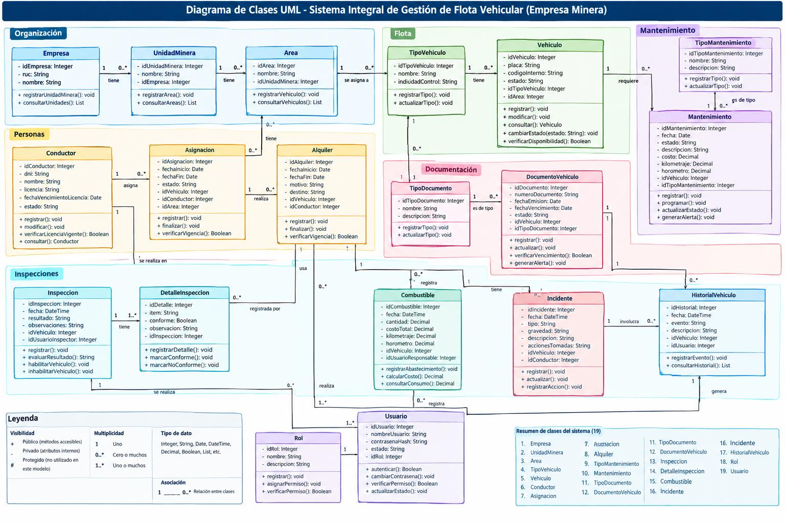
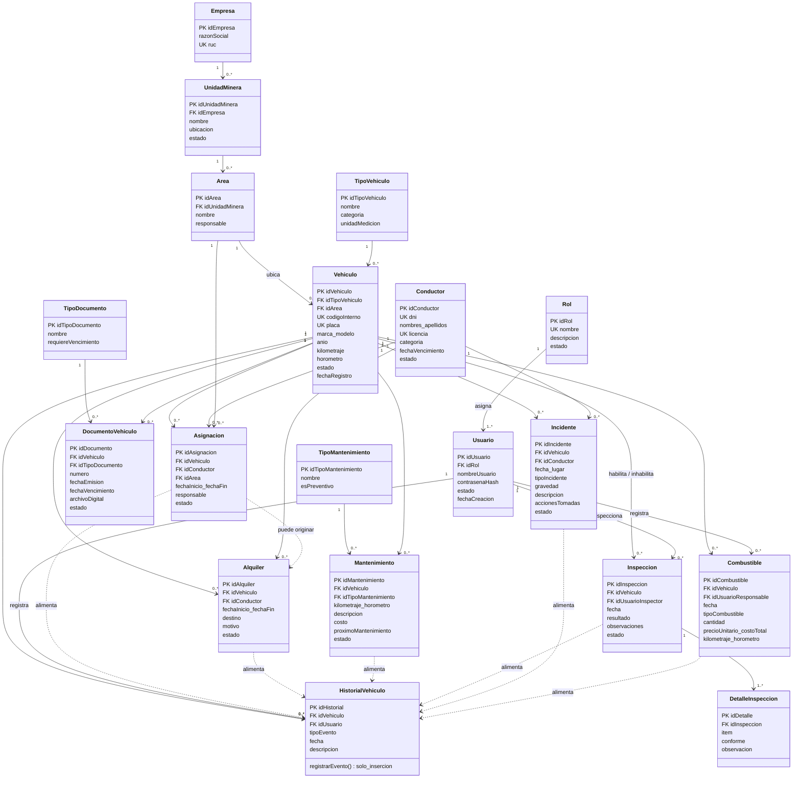

# Informe del diagrama de clases UML

> Parte del proyecto [Sistema de Gestión de Flota Vehicular](../README.md) · Documento original en PDF: [`05 -INFORME DEL DIAGRAMA DE CLASES UML.pdf`](../originales/05%20-INFORME%20DEL%20DIAGRAMA%20DE%20CLASES%20UML.pdf)

---

**Sistema Integral de Gestión de Flota Vehicular para Empresa Minera**

## 1. Introducción

El presente informe desarrolla el modelo de un Sistema Integral de Gestión de Flota Vehicular para una Empresa Minera mediante un Diagrama de Clases UML. El modelo representa las principales entidades involucradas en la administración y operación de la flota, incluyendo la empresa, unidades mineras, áreas, vehículos, conductores, asignaciones, alquileres, mantenimiento, documentación, inspecciones, combustible, incidentes, historial y seguridad de usuarios.

El propósito del modelado es organizar la información y representar de manera visual la estructura del sistema y las relaciones existentes entre sus diferentes elementos. Esto permite comprender y validar el funcionamiento del sistema antes de implementar la base de datos y desarrollar el software.

El modelo toma como referencia el modelo del dominio y la especificación de requerimientos previamente definidos para el sistema (ver [documento 01](01-modelado-dominio-y-requerimientos.md)). El modelo del dominio contempla 19 clases principales agrupadas en diferentes áreas funcionales de la gestión de flota.

*Diagrama de clases UML del informe (19 clases, con atributos privados y operaciones públicas).*

Versión en Mermaid del modelo de dominio (texto editable)

## 2. Objetivo general

Desarrollar un Diagrama de Clases UML para un sistema integral de gestión de flota vehicular de una empresa minera, que permita representar de manera organizada las entidades, atributos, operaciones, relaciones y multiplicidades necesarias para controlar los vehículos, conductores, mantenimiento, documentación, inspecciones, combustible, incidentes, historial y usuarios.

## 3. Objetivos específicos

- Registrar y consultar la información de los vehículos pertenecientes a la empresa minera.
- Gestionar las unidades mineras y las áreas donde operan los vehículos.
- Administrar los tipos de vehículos existentes en la flota.
- Registrar y consultar la información de los conductores.
- Gestionar las asignaciones de vehículos a conductores y áreas.
- Administrar los alquileres de vehículos cuando el proceso operativo lo requiera.
- Controlar los mantenimientos preventivos y correctivos de los vehículos.
- Gestionar los diferentes tipos de mantenimiento.
- Controlar los documentos asociados a cada vehículo y sus fechas de vencimiento.
- Registrar inspecciones vehiculares y sus respectivos detalles.
- Registrar y controlar el abastecimiento de combustible.
- Registrar y dar seguimiento a los incidentes relacionados con vehículos y conductores.
- Mantener un historial de los eventos importantes relacionados con cada vehículo.
- Administrar usuarios y roles del sistema.
- Generar reportes, alertas y un dashboard para apoyar la gestión de la flota.

Estos objetivos se relacionan con los requerimientos funcionales definidos para la gestión de vehículos, asignaciones, mantenimiento, documentos, inspecciones, combustible, incidentes, historial, usuarios, reportes, alertas y dashboard.

## 4. Alcance del sistema

El sistema contempla los principales procesos relacionados con la gestión y control de una flota vehicular utilizada en una empresa minera.

Su alcance comprende el registro y administración de la empresa, unidades mineras, áreas, tipos de vehículos, vehículos y conductores. También considera la asignación y alquiler de vehículos, mantenimiento, documentación, inspecciones, abastecimiento de combustible, registro de incidentes e historial de operaciones.

Además, el sistema incluye la administración de usuarios y roles, así como mecanismos de reportes, alertas y dashboard para facilitar el control operativo y administrativo de la flota.

## 5. Requerimientos funcionales principales

| Código | Requerimiento | Descripción |
| --- | --- | --- |
| RF-01 | Gestionar vehículos | Permitir registrar, modificar, consultar y controlar la información de los vehículos. |
| RF-02 | Gestionar conductores | Registrar y consultar los datos de los conductores y sus licencias. |
| RF-03 | Gestionar asignaciones | Registrar y controlar la asignación de vehículos a conductores y áreas. |
| RF-04 | Gestionar alquileres | Registrar y controlar alquileres de vehículos cuando corresponda al proceso de la empresa. |
| RF-05 | Gestionar mantenimiento | Registrar mantenimientos, tipos de mantenimiento, estados y programación. |
| RF-06 | Gestionar documentos | Registrar documentos de vehículos y controlar sus fechas de vencimiento. |
| RF-07 | Gestionar inspecciones | Registrar inspecciones y controlar sus resultados y detalles. |
| RF-08 | Gestionar combustible | Registrar abastecimientos, cantidades, costos y consumo de combustible. |
| RF-09 | Gestionar incidentes | Registrar incidentes relacionados con vehículos y conductores. |
| RF-10 | Gestionar historial | Mantener el historial de eventos y operaciones importantes de los vehículos. |
| RF-11 | Gestionar usuarios y roles | Administrar usuarios y controlar sus funciones según el rol asignado. |
| RF-12 | Generar reportes | Generar información para apoyar la gestión y supervisión de la flota. |
| RF-13 | Gestionar alertas | Generar alertas relacionadas con mantenimiento y vencimiento de documentos. |
| RF-14 | Dashboard | Presentar información resumida para facilitar el seguimiento de la flota. |

Los requerimientos RF-01 a RF-14 corresponden a los requerimientos funcionales definidos en el documento del sistema.

## 6. Requerimientos no funcionales

- **Seguridad:** el acceso a las funciones del sistema debe depender del rol asignado a cada usuario.
- **Integridad:** las relaciones entre vehículos, conductores, asignaciones, mantenimientos, documentos e inspecciones deben mantenerse correctamente.
- **Disponibilidad:** el sistema debe permitir consultar y registrar información durante la operación de la empresa.
- **Usabilidad:** las interfaces deben ser claras para facilitar la gestión de la flota.
- **Rendimiento:** las consultas frecuentes sobre vehículos, disponibilidad, mantenimiento e historial deben responder de manera adecuada.
- **Trazabilidad:** las operaciones importantes deben quedar registradas para permitir conocer los eventos realizados sobre los vehículos.
- **Auditoría:** las operaciones críticas deben poder asociarse con un usuario y quedar registradas en el historial.
- **Integridad histórica:** los registros históricos no deben eliminarse mediante las operaciones ordinarias del sistema.

Estas características se relacionan con las reglas de seguridad, auditoría, trazabilidad e integridad establecidas para el sistema.

## 7. Entidades y responsabilidades

| Entidad | Responsabilidad |
| --- | --- |
| Empresa | Mantener la información de la empresa y sus unidades mineras. |
| UnidadMinera | Representar una unidad minera perteneciente a la empresa y administrar sus áreas. |
| Area | Representar las áreas donde se encuentran u operan los vehículos. |
| TipoVehiculo | Clasificar los vehículos según su tipo. |
| Vehiculo | Mantener la información, estado, ubicación y disponibilidad del vehículo. |
| Conductor | Mantener los datos del conductor, DNI y licencia. |
| Asignacion | Registrar la asignación de un vehículo a un conductor y área. |
| Alquiler | Registrar el alquiler de un vehículo cuando el proceso de la empresa lo requiera. |
| TipoMantenimiento | Clasificar los tipos de mantenimiento realizados a los vehículos. |
| Mantenimiento | Registrar y controlar los mantenimientos realizados o programados. |
| TipoDocumento | Clasificar los documentos requeridos para los vehículos. |
| DocumentoVehiculo | Registrar los documentos de cada vehículo y controlar su vencimiento. |
| Inspeccion | Registrar las inspecciones realizadas a los vehículos y determinar su resultado. |
| DetalleInspeccion | Registrar los diferentes puntos o ítems evaluados durante una inspección. |
| Combustible | Registrar el abastecimiento, cantidad, costo y consumo de combustible. |
| Incidente | Registrar incidentes relacionados con vehículos y conductores. |
| HistorialVehiculo | Mantener el registro histórico de eventos y operaciones importantes del vehículo. |
| Rol | Definir las funciones y permisos disponibles para los usuarios. |
| Usuario | Permitir el acceso al sistema y ejecutar funciones de acuerdo con el rol asignado. |

Estas entidades corresponden a las 19 clases identificadas en el modelo del dominio del proyecto.

## 8. Relaciones principales y multiplicidades

| Relación | Multiplicidad | Interpretación |
| --- | --- | --- |
| Empresa — UnidadMinera | 1 : 0..* | Una empresa puede tener cero o muchas unidades mineras; cada unidad minera pertenece a una empresa. |
| UnidadMinera — Area | 1 : 0..* | Una unidad minera puede tener cero o muchas áreas; cada área pertenece a una unidad minera. |
| Area — Vehiculo | 1 : 0..* | Un área puede tener cero o muchos vehículos; cada vehículo se encuentra asociado a un área. |
| TipoVehiculo — Vehiculo | 1 : 0..* | Un tipo de vehículo puede corresponder a muchos vehículos; cada vehículo pertenece a un tipo. |
| Vehiculo — Asignacion | 1 : 0..* | Un vehículo puede tener múltiples registros de asignación a lo largo del tiempo. |
| Vehiculo — Alquiler | 1 : 0..* | Un vehículo puede tener múltiples alquileres a lo largo del tiempo cuando este proceso exista. |
| Conductor — Asignacion | 1 : 0..* | Un conductor puede participar en múltiples asignaciones. |
| Conductor — Alquiler | 1 : 0..* | Un conductor puede estar asociado a múltiples alquileres. |
| Conductor — Incidente | 1 : 0..* | Un conductor puede estar relacionado con múltiples incidentes. |
| Vehiculo — Mantenimiento | 1 : 0..* | Un vehículo puede registrar múltiples mantenimientos. |
| TipoMantenimiento — Mantenimiento | 1 : 0..* | Un tipo de mantenimiento puede utilizarse en múltiples registros. |
| Vehiculo — DocumentoVehiculo | 1 : 0..* | Un vehículo puede tener múltiples documentos. |
| TipoDocumento — DocumentoVehiculo | 1 : 0..* | Un tipo de documento puede utilizarse en múltiples documentos vehiculares. |
| Vehiculo — Inspeccion | 1 : 0..* | Un vehículo puede tener múltiples inspecciones. |
| Inspeccion — DetalleInspeccion | 1 : 1..* | Una inspección debe contener uno o varios detalles de inspección. |
| Vehiculo — Combustible | 1 : 0..* | Un vehículo puede tener múltiples registros de abastecimiento. |
| Vehiculo — Incidente | 1 : 0..* | Un vehículo puede estar relacionado con múltiples incidentes. |
| Vehiculo — HistorialVehiculo | 1 : 0..* | Un vehículo puede tener múltiples registros históricos. |
| Rol — Usuario | 1 : 1..* | Un rol puede estar asignado a uno o varios usuarios. |

Las relaciones y multiplicidades se basan en las asociaciones principales establecidas en el modelo conceptual del proyecto.

## 9. Explicación de UML utilizado

UML (Unified Modeling Language) es un lenguaje gráfico utilizado para representar y comunicar la estructura y el comportamiento de un sistema. En este trabajo se utiliza principalmente el Diagrama de Clases UML, que permite representar las clases, atributos, operaciones y relaciones del sistema.

- **Clase:** representa una entidad o concepto del sistema (por ejemplo `Vehiculo`, `Conductor`, `Mantenimiento`, `Inspeccion`, `Usuario`).
- **Atributo:** característica o dato perteneciente a una clase (por ejemplo, en `Vehiculo`: `idVehiculo: Integer`, `placa: String`, `codigoInterno: String`). Se toman como referencia los atributos del modelo lógico de datos.
- **Método u operación:** acción que puede realizar una clase (por ejemplo `+ registrar(): void`, `+ modificar(): void`, `+ consultar(): Vehiculo`, `+ cambiarEstado(estado: String): void`).
- **Asociación:** relación entre dos clases; por ejemplo, `Empresa ───── UnidadMinera` indica que una empresa se relaciona con sus unidades mineras.
- **Multiplicidad:** cuántas instancias de una clase participan en una relación: `1` exactamente uno, `0..1` cero o uno, `0..*` cero o muchos, `1..*` uno o muchos.
- **Visibilidad:** `+` público, `-` privado, `#` protegido. Se usaron principalmente atributos privados (`-`) y operaciones públicas (`+`), aplicando encapsulamiento. No se usa `#` porque el modelo actual no define una jerarquía de herencia entre las clases.

## 10. Control y gestión operativa de la flota

El módulo de gestión operativa permite controlar el estado y disponibilidad de los vehículos utilizados por la empresa minera.

La clase `Vehiculo` mantiene información como su identificador, tipo, área, placa y código interno. A partir de esta clase se relacionan procesos importantes como asignaciones, mantenimiento, inspecciones, abastecimiento de combustible, incidentes y registro histórico.

El sistema también debe controlar las condiciones de operación de los vehículos. Por ejemplo, un vehículo que se encuentre en mantenimiento no debe ser asignado y un vehículo fuera de servicio no debe utilizarse. Asimismo, las inspecciones pueden determinar si un vehículo puede continuar habilitado para operar o si debe quedar inhabilitado.

## 11. Módulos del sistema

1. **Módulo de Organización** – Gestión de empresa, unidades mineras y áreas.
2. **Módulo de Flota** – Registro y control de tipos de vehículos y vehículos.
3. **Módulo de Conductores** – Gestión de conductores y licencias.
4. **Módulo de Asignaciones** – Control de asignaciones de vehículos.
5. **Módulo de Alquileres** – Gestión de vehículos alquilados cuando corresponda.
6. **Módulo de Mantenimiento** – Registro, programación y seguimiento de mantenimientos.
7. **Módulo de Documentación** – Control de documentos y fechas de vencimiento.
8. **Módulo de Inspecciones** – Registro y evaluación de inspecciones vehiculares.
9. **Módulo de Combustible** – Registro de abastecimiento, cantidades y costos.
10. **Módulo de Incidentes** – Registro y seguimiento de incidentes.
11. **Módulo de Historial** – Trazabilidad de los eventos relacionados con cada vehículo.
12. **Módulo de Seguridad** – Administración de usuarios y roles.
13. **Módulo de Reportes y Dashboard** – Consulta de información y apoyo a la toma de decisiones.

## 12. Reglas de negocio propuestas

- Una empresa puede tener una o varias unidades mineras.
- Una unidad minera puede contener diferentes áreas.
- La placa de un vehículo debe ser única.
- El código interno de un vehículo debe ser único.
- El DNI de un conductor debe ser único.
- La licencia de conducir debe ser única para cada conductor.
- Un vehículo no puede tener operaciones activas incompatibles simultáneamente.
- Un vehículo en mantenimiento no puede ser asignado.
- Un vehículo fuera de servicio no puede ser utilizado.
- Todo mantenimiento debe estar asociado a un vehículo y a un tipo de mantenimiento.
- Los documentos que tengan vencimiento deben conservar su fecha de vencimiento.
- Las operaciones críticas deben quedar registradas para fines de auditoría.
- Los registros históricos no deben eliminarse mediante las operaciones ordinarias.
- Las funciones disponibles para cada usuario dependen exclusivamente del rol asignado.
- El resultado de una inspección puede habilitar o inhabilitar un vehículo.

Estas reglas se encuentran contempladas en las reglas de negocio del documento base del sistema.

## 13. Bitácora de uso de IA

Para la elaboración del Diagrama de Clases UML se utilizó una herramienta de Inteligencia Artificial generativa como apoyo en el análisis, organización y representación del modelo. La IA permitió proponer la estructura de las clases, atributos, operaciones, visibilidad y multiplicidades tomando como referencia el modelo del dominio y los requerimientos del sistema.

La IA fue utilizada como herramienta de apoyo. La validación final del contenido corresponde al estudiante, quien contrastó las propuestas con el modelo conceptual, los requerimientos funcionales y las reglas de negocio del proyecto.

| Fecha | Actividad | Uso de IA | Resultado |
| --- | --- | --- | --- |
| 18/09/2026 | Identificación de clases | Apoyo en el análisis del modelo del dominio | Se identificaron las 19 clases principales del sistema. |
| 18/09/2026 | Definición de atributos | Apoyo en la organización de atributos y tipos de datos | Se estructuraron los atributos correspondientes a las clases. |
| 18/09/2026 | Definición de operaciones | Apoyo en la propuesta de responsabilidades de cada clase | Se definieron operaciones principales para las clases. |
| 18/09/2026 | Definición de visibilidad | Apoyo en la aplicación de encapsulamiento UML | Se estableció - para atributos y + para operaciones. |
| 18/09/2026 | Definición de multiplicidades | Apoyo en la representación de las relaciones | Se establecieron multiplicidades como 1, 0..* y 1..*. |
| 18/09/2026 | Elaboración del diagrama | Generación y organización visual del modelo | Se obtuvo un diagrama de clases UML completo. |
| 18/09/2026 | Validación del modelo | Comparación con el modelo conceptual y requerimientos | Se revisaron las relaciones y reglas de negocio del sistema. |

### Decisiones técnicas tomadas con apoyo de IA

- Mantener las 19 clases definidas en el modelo del dominio.
- Utilizar atributos privados para favorecer el encapsulamiento.
- Utilizar operaciones públicas para representar las acciones principales de cada clase.
- No utilizar visibilidad protegida porque no se definió herencia entre las clases.
- Representar las relaciones mediante asociaciones UML.
- Utilizar multiplicidades de acuerdo con las relaciones establecidas en el modelo conceptual.
- Contrastar el diagrama con las reglas de negocio para evitar relaciones incompatibles.
- Utilizar los atributos del modelo lógico como referencia para la construcción de los atributos UML.

El modelo lógico del proyecto define las tablas, identificadores y relaciones necesarias para la posterior implementación de la base de datos (ver [`database/schema.sql`](../database/schema.sql)).

## 14. Conclusión

El Diagrama de Clases UML permite visualizar de manera organizada la estructura del Sistema Integral de Gestión de Flota Vehicular para una Empresa Minera.

La identificación de las clases, atributos, operaciones, visibilidad, asociaciones y multiplicidades permite representar los principales procesos relacionados con la administración de vehículos, conductores, asignaciones, mantenimiento, documentación, inspecciones, combustible, incidentes, historial y seguridad.

El modelo también permite comprobar que las relaciones entre las diferentes entidades sean coherentes con las reglas de negocio del sistema. De esta manera, el diagrama constituye una base para continuar con las siguientes etapas del desarrollo, como el modelo entidad-relación, diseño de la base de datos, implementación de tablas, desarrollo del sistema, diagramas de casos de uso, diagramas de secuencia y diseño de interfaces.

Finalmente, el uso de Inteligencia Artificial permitió apoyar la organización y construcción del modelo UML, pero las decisiones finales fueron contrastadas con el modelo conceptual, los requerimientos y las reglas de negocio previamente establecidos para el proyecto.
